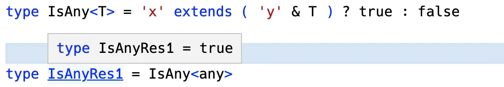
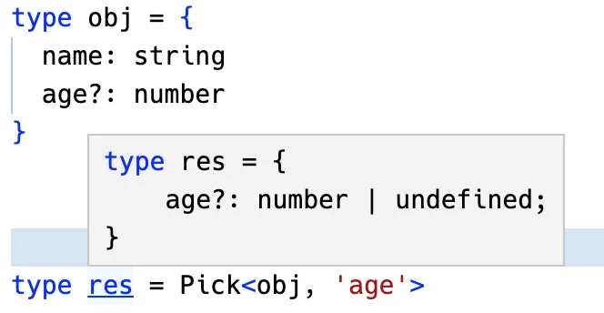
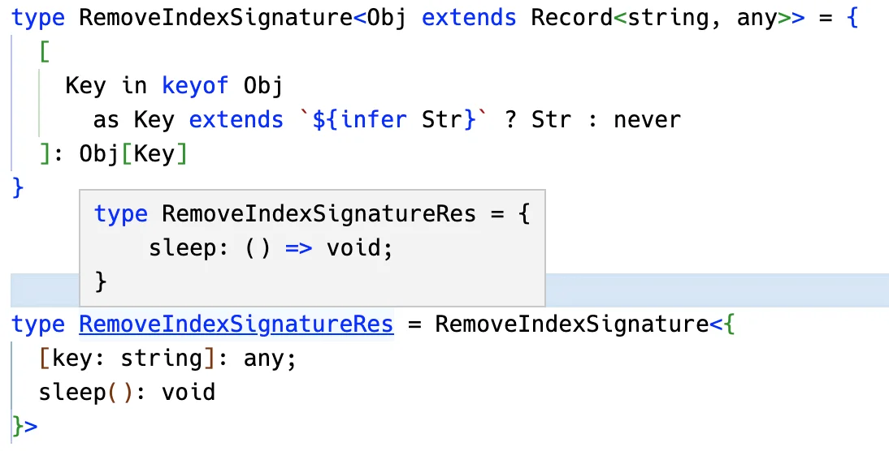

我们会了提取、构造、递归、数组长度的计数、联合类型的分散之后，各种类型体操都能写了 ，只不过有些类型的特性比较特殊，要专门记一下。

这是类型体操的第六个套路：**特殊特性要记清**。


## 特殊类型的特性

TypeScript 类型系统中有些类型比较特殊，

- 比如 any、never、联合类型，
- 比如 class 有 public、protected、private 的属性，
- 比如索引类型有具体的索引和可索引签名，索引还有可选和非可选。。。

如果给我们一种类型让我们判断是什么类型，应该怎么做呢？

**类型的判断要根据它的特性来，比如判断联合类型就要根据它的 `distributive` 的特性。**

我们分别看一下这些特性：


## IsAny

如何判断一个类型是 any 类型呢？要根据它的特性来：

📚 **any 类型与任何类型的交叉都是 any，也就是 `1 & any` 结果是 any。**

所以，可以这样写：

```typescript
type IsAny<T> = 'x' extends ('y' & any) ? true : false
```

这里的 'x' 和 'y' 可以换成任意类型。

当传入 any 时：



当传入其他类型时：


## IsEqual

之前我们实现 [IsEqual](./7#⚡-includes) 是这样写的：

```typescript
type IsEqual<A, B> = 
  (A extends B ? true : false) & (B extends A ? true : false)
```

问题也出在 `any` 的判断上：


**因为 any 可以是任何类型，任何类型也都是 any，所以当这样写判断不出 any 类型来。**

所以，我们会这样写：

```typescript
type IsEqual2<A, B> =
  (<T>() => T extends A ? 1 : 2) extends (<T>() => T extends B ? 1 : 2)
    ? true
    : false
```

这样就能正常判断了：


这是因为 TS 对这种形式的类型做了特殊处理，是一种 hack 的写法，它的解释要从 TypeScript 源码找答案了，放到原理篇我们一起读下 TypeScript 源码。这里暂时就这样写吧。


## IsUnion

还记得怎么判断 [union](./9#⚡-isunion) 类型么？要根据它遇到条件类型时会分散成单个传入做计算的特性：

```typescript
type IsUnion<A, B = A> =
  A extends A
    ? [B] extends [A]
      ? false
      : true
    : never
```

- 这里的 A 是单个类型，B 是整个联合类型，所以根据 `[B] extends [A]` 是否成立来判断是否是联合类型。


当传入单个类型时：


## IsNever

📚`never` 在条件类型中也比较特殊，如果条件类型左边是类型参数，并且传入的是 never，那么直接返回 never：

```typescript
type TestNever<T> = T extends number ? 1 : 2
```

当 T 为 never 时：


所以，要判断 never 类型，就不能直接 T extends number，可以这样写：

```typescript
type IsNever<T> = [T] extends [never] ? true : false
```

这样就能正常判断 never 类型了：


📚除此以外，**any 在条件类型中也比较特殊，如果类型参数为 any，会直接返回 trueType 和 falseType 的合并**：

```typescript
type TestAny<T> = T extends number ? 1 : 2
```


联合类型、never、any 在作为条件类型的类型参数时的这些特殊情况，也会在后面的原理篇来解释原因。


## ⚡ IsTuple

元组类型怎么判断呢？它和数组有什么区别呢？

- **元组类型也是数组类型，但每个元素都是`只读`的，并且 `length` 是数字字面量，而数组的 length 是 number。**

第一个特性，元组类型也是数组类型，并且每个元素都是只读，这个很好理解。

我们重点来看第二个特性：


如图，元组和数组的 `length` 属性值是有区别的。

那我们就可以根据这两个特性来判断元组类型：

```typescript
type IsTuple<T> =
  T extends readonly [...params: infer Eles]
    ? NotEqual<Eles['length'], number>
    : false
```

- 类型参数 T 是要判断的类型。
- 首先判断 T 是否是数组类型，如果不是则返回 false。如果是继续判断 length 属性是否是 number。
- 如果是数组并且 length 不是 number 类型，那就代表 T 是元组。

`NotEqual` 的实现是这样的：

```typescript
type NotEqual<A, B> =
  (<T>() => T extends A ? 1 : 2) extends (<T>() => T extends B ? 1 : 2)
    ? false
    : true
```

- A 是 B 类型，并且 B 也是 A 类型，那么就是同一个类型，返回 false，否则返回 true。

这样就可以判断出元组类型：

当传入**元组**时：


当传入**数组**时：


## UnionToIntersection

📚 **类型之间是有父子关系的，更具体的那个是子类型，比如 A 和 B 的交叉类型 `A & B` 就是联合类型 `A | B` 的子类型，因为更具体。**

- 如果允许父类型赋值给子类型，就叫做**逆变**。
- 如果允许子类型赋值给父类型，就叫做**协变**。
- （关于逆变、协变等概念的详细解释可以看原理篇）

📚在 TypeScript 中有**函数参数是有逆变的性质**的，也就是如果参数可能是多个类型，参数类型会变成它们的交叉类型。

所以联合转交叉可以这样实现 ：

```typescript
type UnionToIntersection<U> =
  (U extends U ? (x: U) => unknown : never) extends (x: infer R) => unknown
    ? R
    : never
```

- 类型参数 U 是要转换的联合类型。
- U extends U 是为了触发联合类型的 distributive 的性质，让每个类型单独传入做计算，最后合并。
- 利用 U 做为参数构造个函数，通过模式匹配取参数的类型。

结果就是交叉类型：


函数参数的逆变性质一般就联合类型转交叉类型会用，记住就行。


## ⚡ GetOptional

如何提取索引类型中的可选索引呢？

这也要利用可选索引的特性：**可选索引的值为 undefined 和值类型的联合类型**。


过滤可选索引，就要构造一个新的索引类型，过程中做过滤：

```typescript
type GetOptional<Obj extends Record<string, any>> = {
  [
    Key in keyof Obj as {} extends Pick<Obj, Key> ? Key : never
  ]: Obj[Key]
}
```

- 类型参数 Obj 为待处理的索引类型，类型约束为索引为 string、值为任意类型的索引类型 `Record<string, any>`
- 用**映射**类型的语法重新构造索引类型，索引是之前的索引也就是 `Key in keyof Obj`，但要做一些**过滤**，也就是 `as` 之后的部分
- 过滤的方式就是单独取出该索引之后，判断空对象是否是其子类型
- 这里的 Pick 是 ts 提供的内置高级类型，就是取出某个 Key 构造新的索引类型

```typescript
type Pick<T, K extends keyof T> = { [P in K]: T[P]; }
```

比如单独取出 age 构造的新的索引类型是这样的：



📚因为 age 可能为 undefined，也就是索引类型可能是 {}，所以 `{} extends Pick<Obj, Key>` 就能过滤出可选索引。（可选的意思就是有或者没有，没有的时候就是空的索引类型）

值的类型依然是之前的，也就是 Obj[Key]。

这样，就能过滤出所有可选索引，构造成新的索引类型


## GetRequired

实现了 `GetOptional`，那反过来就是 `GetRequired`，也就是过滤所有非可选的索引构造成新的索引类型：

```typescript
// 注意这里的 Obj 是可以写在后面的
type IsRequired<Key extends keyof Obj, Obj> = 
  {} extends Pick<Obj, Key> ? never : Key

type GetRequired<Obj extends Record<string, any>> = {
  [
    Key in keyof Obj as IsRequired<Key, Obj>
  ]: Obj[Key]
}
```

这样就过滤出了非可选类型：


## RemoveIndexSignature

索引类型可能有索引，也可能有可索引签名。

比如：

```typescript
type Dong = {
  [key: string]: any; // 可索引签名
  sleep(): void; // 具体的索引
}
```

这里的 sleep 是具体的索引，`[key: string]: any` 就是可索引签名，代表可以添加任意个 string 类型的索引。

如果想删除索引类型中的可索引签名呢？

📚 同样根据它的性质，**索引签名不能构造成字符串字面量类型，因为它没有名字，而其他索引可以。**

所以，就可以这样过滤：

```typescript
type RemoveIndexSignature<Obj extends Record<string, any>> = {
  [
    Key in keyof Obj
      as Key extends `${infer Str}` ? Str : never
  ]: Obj[Key]
}
```

- 类型参数 Obj 是待处理的索引类型，约束为 `Record<string, any>`
- 通过映射类型语法构造新的索引类型，索引是之前的索引 `Key in keyof Obj`，但要做一些过滤，也就是 as 之后的部分
- 如果索引是字符串字面量类型，那么就保留，否则返回 never，代表过滤掉
- 值保持不变，也就是 Obj[Key]

这样就可以过滤掉可索引签名：




## ClassPublicProps

如何过滤出 class 的 public 的属性呢？

也同样是根据它的特性：**keyof 只能拿到 class 的 public 索引，private 和 protected 的索引会被忽略**。

比如这样一个 class：

```typescript
class Dong {
  public name: string;
  protected age: number;
  private hobbies: string[];

  constructor() {
    this.name = 'dong';
    this.age = 20
    this.hobbies = ['sleep', 'eat']
  }
}
```

keyof 拿到的只有 name：


所以，我们就可以根据这个特性实现 public 索引的过滤：

```typescript
type ClassPublicProps<Obj extends Record<string, any>> = {
  [key in keyof Obj]: Obj[Key]
}
```

- 类型参数 Obj 为带处理的索引类型，**类和对象都是索引类型**，约束为 `Record<string, any>`
- 构造新的索引类型，索引是 `keyof Obj` 过滤出的索引，也就是 public 的索引
- 值保持不变，依然是 Obj[Key]

这样就能过滤出 public 的属性：


## 总结

学完前面 5 个套路，我们已经能够实现各种类型编程逻辑了，但一些类型的特性还是要记一下。在判断或者过滤类型的时候会用到：

1. `any` 类型与任何类型的交叉都是 any，也就是 `1 & any` 结果是 any，可以用这个特性判断 any 类型
2. 联合类型作为类型参数出现在条件类型左侧时，会分散成单个类型传入，最后合并
3. `never` 作为类型参数出现在条件类型左侧时，会直接返回 never
4. any 作为类型参数出现在条件类型左侧时，会直接返回 trueType 和 falseType 的联合类型🤩
5. `元组类型`也是数组类型，但每个元素都是只读的，并且 length 是数字字面量，而数组的 length 是 number。可以用来判断元组类型
6. 函数参数处会发生逆变，可以用来实现联合类型转交叉类型
7. 可选索引的值为 undefined 和值类型的联合类型。可以用来过滤可选索引，反过来也可以过滤非可选索引
8. 索引类型的索引为字符串字面量类型，而可索引签名不是，可以用这个特性过滤掉可索引签名
9. keyof 只能拿到 class 的 public 的索引，可以用来过滤出 public 的属性

这些类型的特性要专门记一下，其实过两遍就记住了。

熟悉了这些特殊的特性，配合提取、构造、递归、数组长度计数、联合分散这五种套路，就可以实现各种类型体操。

- [TS Playground汇总](https://www.typescriptlang.org/play?#code/PTAEEkGcEEDsE8BQAXeAHAphGCA8AVAPlAF5QByAEwHtYBzc0DAD2Q1kslAApy6BXAIb1GAMlD4AlKAD8oZACd+WAFygAZoIA2kDIhTosUOPABKGSPy3JS2E7mHxCAbn2pMdhOcvWATLeM8PiERF30QbABRAEchLQMPKBi43GgAGlAAIWIybmgmVnZOLNlQAEZQNV9pcW5MgrYOLny5CqrJVwSjSGTtbwCe2O1cckFyDMcwrqihrV9UjOzbbgJCbmkSYnwGoubSttBqnaaeVfXSLePi+tbKw8lEUCfSxWU7zR0MTvdu3rn+shJWbzUbjUCTToRKAAVVgAEtaNMYfDaAsSmRoDlHs98ixGsVoNjns85ABtTIAXSuXFJ0ApROJjLkH10DMZzzUrz07KealgGAAbhgFG5DNhYQjYN4rDZAZAJajyNBGAAfCiZchhH7ilFSiwy-xyhWwEbKqYgKAAOUFwqRkGtQoUq1spPwVLxu1ApP5jqpci5720rLtDuF0usA1DTp9wq1YqtNoU4eQhuwUYcCCm2vwFmQ9iItm2HpOsH4AFsAEbC-Z3XzfMU5yB5rwWQu5+wQ8LAKD4fhoLR6bUD2AusppXxpADMFNJ5GHdGQAAtyBT6x5h6nS5XhaSZ3P2Avl-S7b3+xhnWQGUXCicFBhBDRYFp4F6AHTvtCCBSCMuQNRw2B1GrSIB0gKk2RJUBLWoZA-lwECLFneclxXDItyrBRiAg3kNCDL5RQ8aDYNmNElkvYkViIc5NgkalQBacpa2kYtikotYNkuFiuBuRj2mw0oWVUeQlHwgjulPAdkwGCTz1JMdDgyacs3jSAZOTVMez7AdcHQncKXNYBjXwahwFgNgFF0ABjZBJTE0AjJMszhSsmzUWhHJQAZbhoTony5G4Zg1GhDjQH4WAAGtYGoAB3Ec+UTZib1YwLQAAoCFFAUwQrCyKYtgfi5FMfj4sdNcsAc0zzJcyUpLICqnIsjBrMlXAAG9QAEYQ6DUCoAF9QDVdrH26w5QF6gyAHEMGQAB5NBXNgbRpim2b5slYYZorAArOjMqa6gFEoXAmwUAC6AmTMPNahlSX4gBpDAXwA0Bwse6h1FATadv44lBC4Vr+q40AAAU4Us8LcC+jIHqcUoYbuGMRWJKk1C+0kYdXRBev0Zbprmha+n1CMyBW-H1q0NrsUWssMDUE6ztcJ5BDoDAZD5csMNccbIWAFbzFiOE70oaY4Ugfn+EFjAjvhoHXvgd7Pu2jIvo8hkAbo0HwchpXQBh4g5ERu4YbK0A+YwAWhe1nagfMSyDqO+n6Aupwrs84l0ce1KRzlhWvvBLhRfFyXpce5XtsIClUe2j34HA7HceQIOhdq03pqTqXKaeanadAR26EZ8EWbZ0BdIULmDPMMtqCFUzKBYABlOE6EW5B+DvaZK+rjBa4bpuW7b88-Zt-bDuOxQzudwgruxW72Xh56fY+v2fv93XPaBgADAASVq0urevFF6je5APjKSttJ5I8VraY-pePtU7muOF75vBFbu8U8f7vn+YRvX-f8810nikjlnTce9Ar6OALpAAcGA0DrDUAKagcJKDl1cCAAAwloP6kBgb8ArFoMGwMFDUDQJARAllsGQC4AAEVoHQUAQDQBoHwYQyyJcfw5zzgXNAJC2DWSloXHOpceGnQFG-LAi5qAVgrHCCwYDTr0F3J0J4dtYAnX4NZA65wmFPCXKLV82dbBUHoeQAuejFwGOZlgMgvgAAM5j5CWMgK+KRMi5FcDILOGBGA4FgnIPeZAK4C7Y3vmKLBOC8EEKISQshKcInUKiWw4hpDIC4DofQKY0wEm4NYTE1JVs6K23tmPRR51wSXVsLor089vZvSXttK+aMMbEixjjIAA)

2023年03月14日13:47:47

