TypeScript 类型编程难么？

难。不然怎么会被叫做类型体操呢。

但其实类型体操是有套路的，我把类型体操的各种套路总结成了一个顺口溜：

**类型体操顺口溜**

**模式匹配做提取，重新构造做变换。**

**递归复用做循环，数组长度做计数。**

**联合分散可简化，特殊特性要记清。**

**基础扎实套路熟，类型体操可通关。**

逐句解释下：


## 模式匹配做提取

就像字符串可以通过正则提取子串一样，TypeScript 的类型也可以通过匹配一个模式类型来提取部分类型到 infer 声明的局部变量中返回。

比如提取函数类型的返回值类型：

```typescript
type GetReturnType<Func extends Function> =
  Func extends (...arg: any) => infer R
    ? R
    : never
```

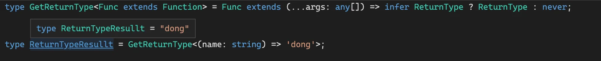

- [参考 GetReturnType](./5#getreturntype)


## 重新构造做变换

TypeScript 类型系统可以通过 type 声明类型变量，通过 infer 声明局部变量，**类型参数在类型编程中也相当于局部变量**，但是它们都不能做修改，想要对类型做变换只能构造一个新的类型，在构造的过程中做过滤和转换。

在字符串、数组、函数、索引等类型都有很多应用，特别是索引类型。

比如把索引变为大写：

```typescript
type UppercaseKey<Obj extends Record<string, any>> = {
  [Key in keyof Obj as Uppercase<Key & string>]: Obj[Key]
}
```


- [参考UppercaseKey](./6#⚡-uppercasekey)


## 递归复用做循环

在 TypeScript 类型编程中，遇到数量不确定问题时，就要条件反射的想到递归，每次只处理一个类型，剩下的放到下次递归，直到满足结束条件，就处理完了所有的类型。

比如把长度不确定的字符串转为联合类型：

```typescript
type StringToUnion<Str extends string> =
  Str extends `${infer First}${infer Rest}`
    ? First | StringToUnion<Rest>
    : never
```

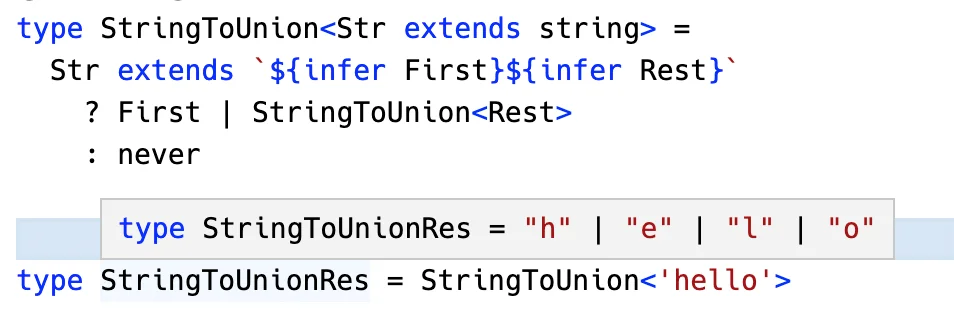

- [查看 StringToUnion](./7#stringtounion)


## 数组长度做计数

TypeScript 类型系统没有加减乘除运算符，但是可以构造不同的数组再取 `length` 来得到相应的结果。这样就把数值运算转为了数组类型的构造和提取。

比如实现减法：

```typescript
type BuildArray<
  Length extends number,
  Elm = unknown
  Arr extends unknown[] = []
> =
  Arr['length'] extends Length
    ? Arr
    : BuildArray<Length, Elm, [Elm, ...Arr]>
    
type Subtract<
  Num1 extends number,
  Num2 extends number
> =
  BuildArray<Num1> extends [...arr1: BuildArray<Num2>, ...arr2: infer Rest]
    ? Rest['length']
    : never
```

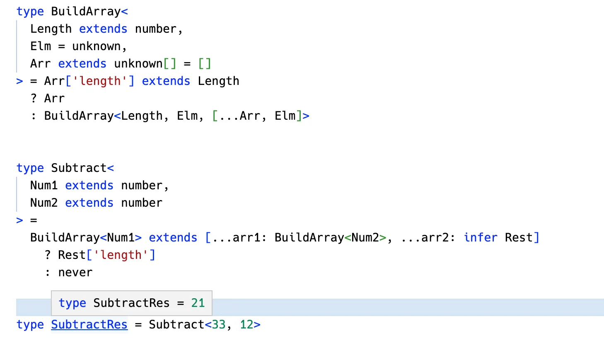

- [查看 Subtract](./8#substract)

## 联合分散可简化

TypeScript 对联合类型做了特殊处理，当遇到字符串类型或者作为类型参数出现在条件类型左边的时候，会分散成单个的类型传入做计算，最后把计算结果合并为联合类型。

```typescript
type UppercaseA<Item extends string> =
  Item extends 'a' ? Uppercase<Item> : Item
```

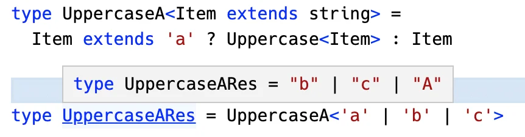

- [查看UppercaseA](./9#分布式条件类型)

这样虽然简化了类型编程，但也带来了一些认知负担。

比如联合类型的判断是这样的：

```typescript
type IsUnion<A, B = A> =
  A extends A
    ? [B] extends [A]
      ? false
      : true
    : never
```

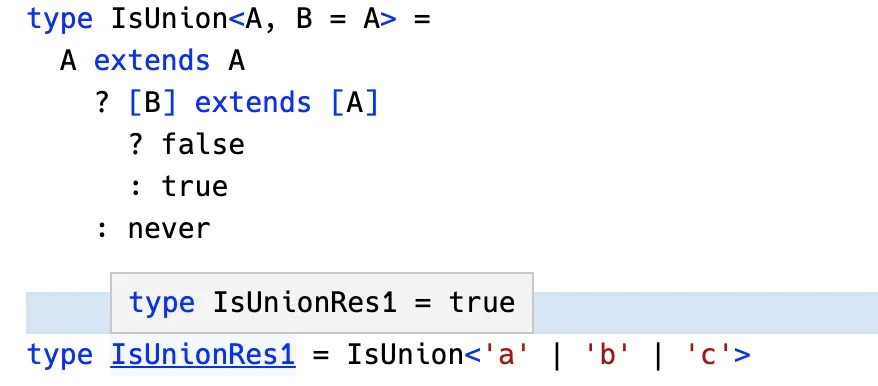

- [查看IsUnion](./9#⚡-isunion)

联合类型做为类型参数直接出现在条件类型**左边**的时候就会触发 distributive 特性，而不是直接出现在左边的时候不会。

所以， A 是单个类型、B 是整个联合类型。通过比较 A 和 B 来判断联合类型。


## 特殊特性要记清

会了提取、构造、递归、数组长度计数、联合类型分散这 5 个套路以后，各种类型体操都能写，但是有一些特殊类型的判断需要根据它的特性来，所以要重点记一下这些特性。

比如 any 和任何类型的交叉都为 any，可以用来判断 any 类型：

```typescript
type IsAny<T> = 'x' extends ('y' & T) ? true : false
```

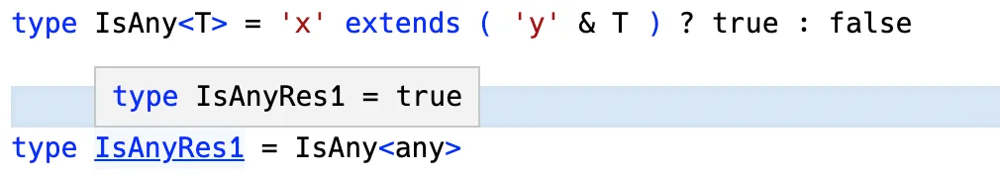

- [查看IsAny](./10#isany)

比如索引一般是 string，而可索引签名不是，可以根据这个来过滤掉可索引签名：

```typescript
type RemoveIndexSignature<Obj extends Record<string, any>> = {
  [Key in keyof Obj
    as Key etends `${infer Str}` ? Str : never
  ]: Obj[Key]
}
```

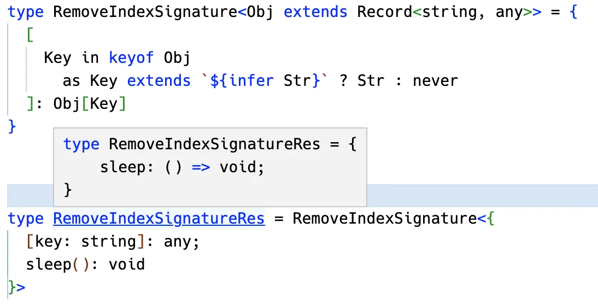

- [查看RemoveIndexSignature](./10#removeindexsignature)

## 基础扎实套路熟，类型体操可通关

基础指的是 TypeScript 类型系统中的各种类型，以及可以对它们做的各种类型运算逻辑，这是类型编程的原材料。

但是只是会了基础不懂一些套路也很难做好类型编程，所以要熟悉上面 6 种套路。

基础扎实、套路也熟了之后，各种类型编程问题都可以搞定，也就是“通关”。


## 练练手

在讲 “TypeScript 类型编程为什么被叫做类型体操” 的时候我举了一个 ParseQueryString 的类型例子，用来说明类型编程的复杂度。

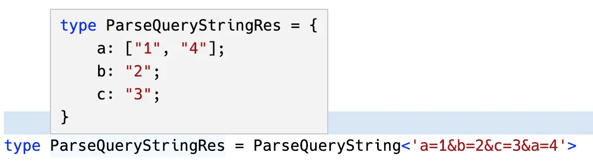

学完了所有套路之后，我们来实现下这个类型：


## ⚡ ParseQueryString

`a=1&b=2&c=3&d=4`，这样的字符串明显是 query param **个数不确定**的，遇到数量不确定的问题，条件反射的就要想到递归：

递归解析出每一个 query params，也就是 `&` 分隔的每个字符串，每个字符串单独去解析，构造成索引类型，最后把这些所有的单个索引类型合并就行。

也就是这样的：

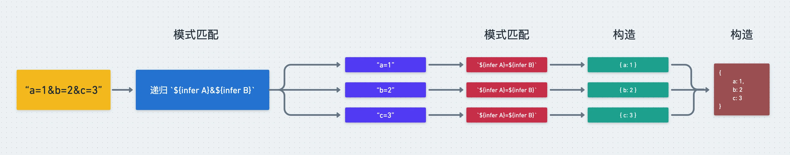

- 第一步并不知道有多少个 a=1、b=2 这种 query param，要递归的做模式匹配来提取。
- 然后每一个 query param 再通过模式匹配取出 key 和 value，构造成索引类型。
- 然后把每个索引类型合并成一个大的索引类型就可以了。

思路理清了，我们一步步来实现下。

1️⃣ 首先，要递归的提取 `&` 分隔的 query param：

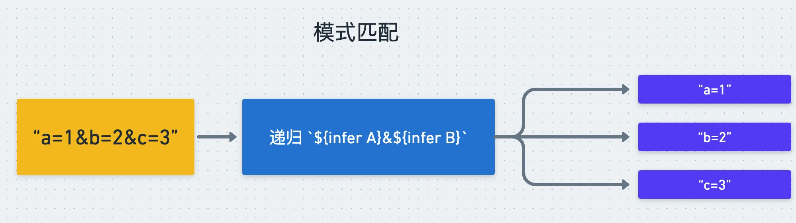

```typescript
type ParseQueryString<Str extends string> =
  Str extends `${infer Param}&${infer Rest}`
    ? MergeParams<ParseParam<Param>, ParseQueryString<Rest>>
    : ParseParam<Str>
```

- 类型参数 Str 为待处理的 query 字符串，通过 extends 约束为 string 类型。
- 提取 & 分割的字符串到 infer 声明的局部变量 Param 里，后面的字符串放到 Rest 里。
- 通过 `ParseParam` 来处理单个的 query param，剩下 query 字符串也是一样的递归处理，然后把这些处理结果合并到一起，也就是 `MergeParams`。
- 当提取不出 & 分割的字符串时递归结束，把剩下的字符串也用 ParseParam 来处理。

2️⃣ `ParseParam` 的实现就是提取和构造：

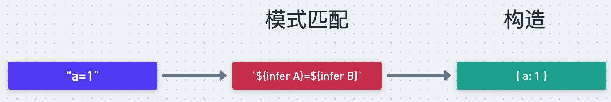

```typescript
type ParseParam<Param extends string> =
  Param extends `${infer Key}=${infer Value}`
    ? {
        [K in Key]: Value
      }
    : {}
```

- 类型参数 Param 类单个的 query param，比如 a=1 这种。
- 通过模式匹配提取 key 和 value 到 infer 声明的局部变量 Key、Value 里。
- 通过映射类型语法构造成索引类型返回：

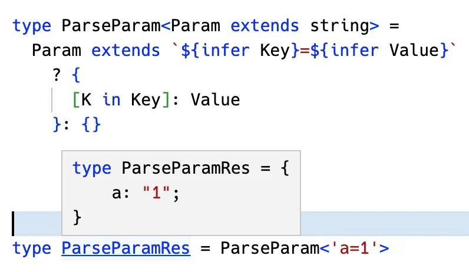

3️⃣ 每个 query param 处理完了，最后把这一系列构造出的索引类型合并成一个就行了：

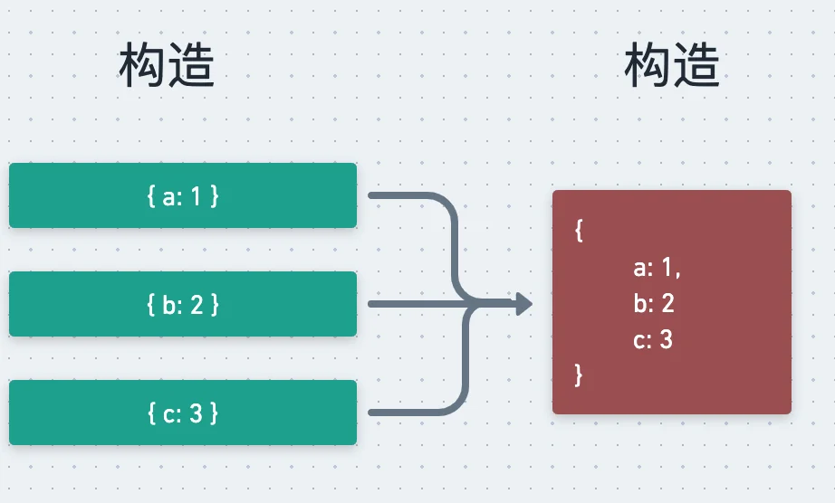

这也是构造索引类型：

```typescript
type MergeParams<
  OneParam extends Record<string, any>
  OtherParam extends Record<string, any>
> = {
  [Key in keyof OneParam | keyof OtherParam]:
    Key extends keyof OneParam
      ? Key extends keyof OtherParam
        ? MergeValues<OneParams[Key], OtherParams<Key>>
        : OneParam[Key]
      : Key extends keyof OtherParams
        ? OtherParam[Key]
        : never
}
```

- 类型参数 OneParam、OtherParam 是要合并的 query param，约束为索引类型（索引为 string，索引值为任意类型。

- 构造一个新的索引类型返回，索引来自两个的合并，也就是 `Key in keyof OneParam | keyof OtherParam`。

- `MegeValues` 的合并逻辑就是如果两个值是同一个就返回一个，否则构造一个数组类型来合并：

```typescript
type MergeValues<One, Other> =
  One extends Other
    ? One
    : Other extends unknown[]
      ? [One, ...Other]
      : [One, Other]
```

- 类型参数 One、Other 是要合并的两个值。
- 如果两者是同一个类型，也就是 One extends Other，就返回任意一个。
- 否则，如果是数组就做数组合并，否则构造一个数组把两个类型放进去。

我们单独测试下索引合并：

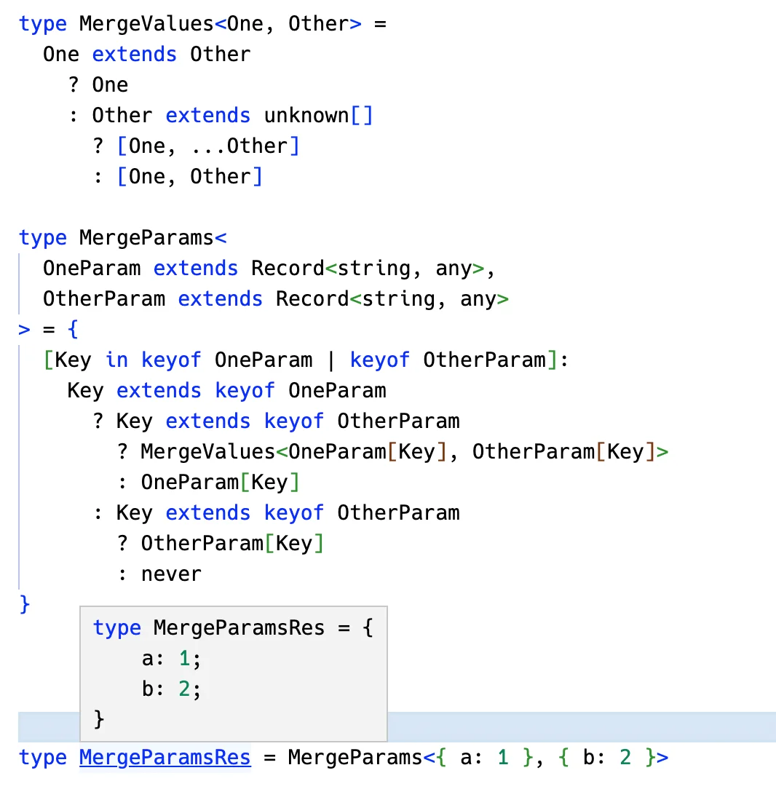

每个 query param 的解析和构造索引类型，多个索引类型的合并都实现了，合并起来也就实现了 query string 的解析：

```typescript
type ParseQueryString<Str extends string> =
  Str extends `${infer Param}&${infer Rest}`
    ? MergeParams<ParseParam<Param>, ParseQueryString<Rest>>
    : ParseParam<Str>
```

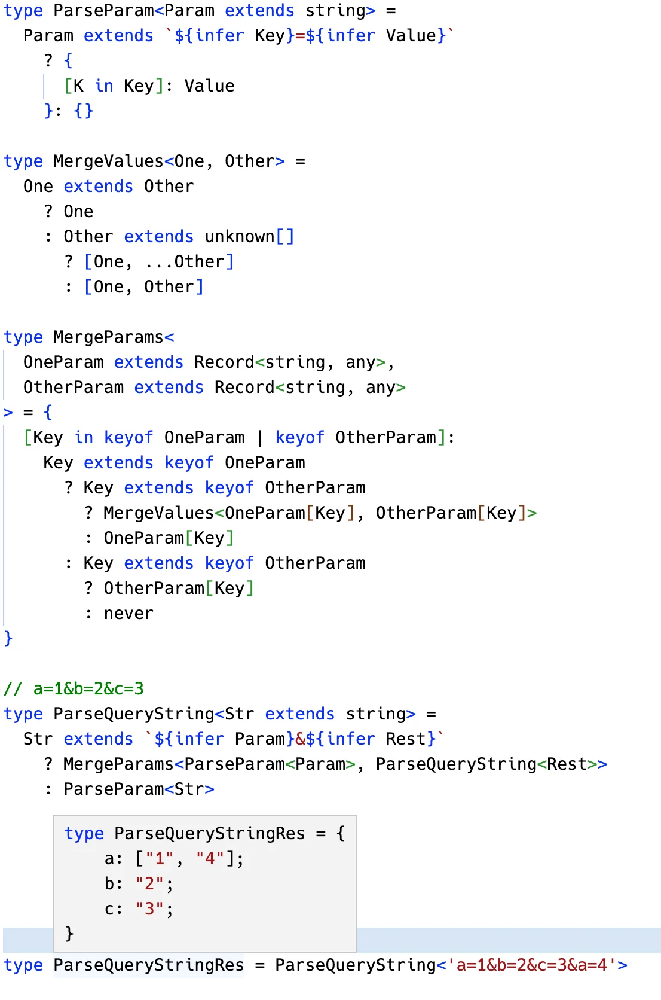

在实现 ParseQueryString 的类型的时候，我们大量用到了`模式匹配做提取`、`重新构造做变换`、`递归复用做循环`这 3 大套路，思路理清之后利用这些套路能够很顺畅的把这个高级类型写出来。

这是最开始被我用来说明类型编程复杂度的例子，是有一定复杂度的，而学到这我们也能实现了。

再回到最开始的问题：

TypeScript 类型编程难么？

其实熟悉一些套路以后，也没那么难。


## 总结

为了方便记忆，我总结了类型体操顺口溜，然后分别解释了每句话的含义，之后又做了一个类型体操来练手。

那个最开始被我用来说明 TypeScript 类型编程复杂度的例子，现在我们也能顺畅的实现了，所用的就是类型体操顺口溜中的套路。

这就像武功秘籍一样，理解了每句话的含义，反复修炼，就能成为类型体操的武林高手：

**模式匹配做提取，重新构造做变换。**

**递归复用做循环，数组长度做计数。**

**联合分散可简化，特殊特性要记清。**

**基础扎实套路熟，类型体操可通关。**


- [TS Playground合集](https://www.typescriptlang.org/play?#code/C4TwDgpgBACghgJwM4XguBbAPGzUIAewEAdgCZJRLAICWJA5gHxQC8UAUFN7InocXKUABgBIA3vQBmEBFADSEEAF9WE6bKgA1OABsArhGXCuPMwH4o402dtQA2vKj0FSgLoAubXsOc73ZSgvcWUAbg4OUEheZFQ+DAAlCCR9XWA2GJRcbAByOFYARhymcMjwaABZWQYIHQNkrAB5EggAGihG4AALWRZ2Gw6W-CJSCg7uzQGLQYgpni9OnrkBUcp9EgBrEgB7AHcSezc5u0t7ZraoADprxdkj-1svM5b224Q3UqjK6rj0DCQsANztlhoIxkkAMbbBBkLDUOiMdpwEggJitIETBAglZCKCQ6Gw+H0BhIlFMDh9KymRxKZwkKAbJTbKQzEEAHwZTJZb2ynj8PEUIFBq05IGZrPixyglkFwtxjLF3Mx2Sl0yqCBqdUMAOB8RpIDcr2VesFbnJDzMCxa2X1938XllOLGCvFPPi-It0vGSxtpo9Fq8LQAbrIOMoIl8oOqatkkEkUmkMtHfpgAeIoHAvAUoMp2umAEZeABMOZKEfKmQgAEVDAgQABlGjErCN5YjXFExiUgatuVjMSSEgyOTZZQAMnUQ808eAxillmTsZwiCy8WXfzRlZrsgbTcYWBnTHN9sr2RbNDL5eiaBQ27rreJ8dS6XYN+rtd3CIYWDyhTH+SLMd81YQCIVYABmYpSg4IA)

2023年03月15日14:13:00

