我们知道，TypeScript 支持 infer 来提取类型的一部分，通过模式匹配的方式。

🌰比如元组类型提取最后一个元素的类型：

```typescript
type Last<Arr extends unknown[]> =
  Arr extends [...infer rest, infer Ele]
    ? Ele
    : never
```

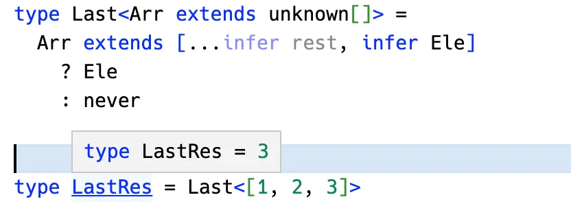


🌰比如函数提取返回值类型：

```typescript
type GetReturnType<Func extends Function> =
  Func extends (...args: any[]) => infer R
    ? R
    : never
```

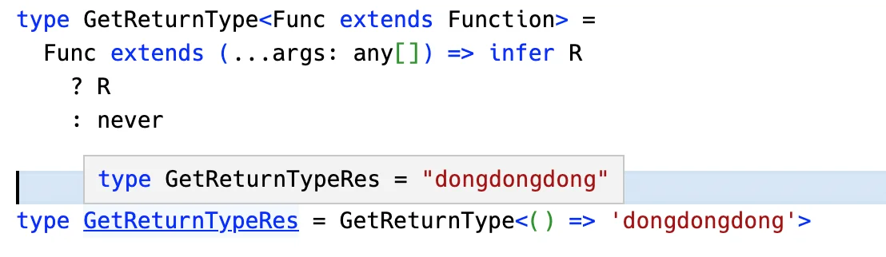

🌰比如字符串提取一部分，然后替换：

```typescript
// 不考虑多个匹配的情况，即不使用递归
type ReplaceStr<
  Str extends string,
  From extends string,
  To extends string
> = Str extends `${infer Prefix}${From}${infer Suffix}`
  ? `${Prefix}${To}${Suffix}`
  : Str
```

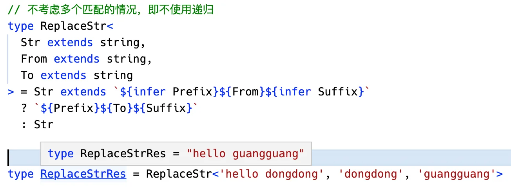


**模式匹配就是通过一个类型匹配一个模式类型，需要提取的部分通过 `infer` 声明一个局部变量，这样就能从局部变量里拿到提取的类型。**

infer 的模式匹配用法还是挺好理解的。

但是 infer 有一个问题，比如这样：

```typescript
type TestLast1<Arr extends string[]> =
  Arr extends [...infer rest, infer Last]
    ? `最后一个是：${Last}` // [!code error]
    : never
```

📚从 string 数组中提取的元素，默认会推导为 `unknown` 类型，这就导致了不能直接把它当 string 用：

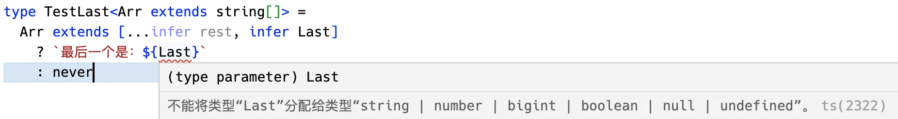

那怎么办呢？

之前的处理方式是这样的：

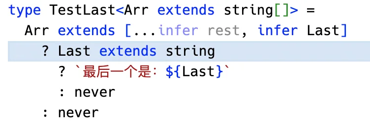


加一层判断，这样 Last 就推导为 string 类型了。

或者也可以和 string **取交叉类型**：

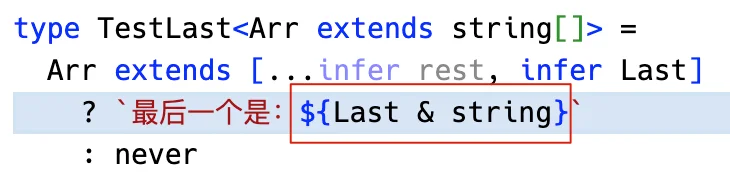

这样也可以作为 string 来用。

但是我们明明知道这里就是 string，却还需要 `& string` 或者 `xxx extends string` 来**转换**一次，这也太麻烦了。

TS 也知道有这个问题，所以在 [v4.7](https://www.typescriptlang.org/docs/handbook/release-notes/typescript-4-7.html#extends-constraints-on-infer-type-variables) 就引入了新语法：`infer extends`🎉。

现在我们可以这样写：

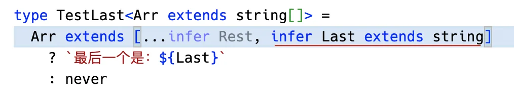

**infer 的时候加上 extends 来约束推导的类型，这样推导出的就不再是 unknown 了，而是约束的类型。**

😏这个语法是 TS 4.7 引入的，在 [4.8](https://www.typescriptlang.org/docs/handbook/release-notes/typescript-4-8.html#improved-inference-for-infer-types-in-template-string-types) 又完善了一下。

比如这样一个类型：

```typescript
type NumInfer<Str> =
  Str extends `${infer Num extends number}`
    ? Num
    : never
```

在 `4.7` 的时候推导结果是这样：

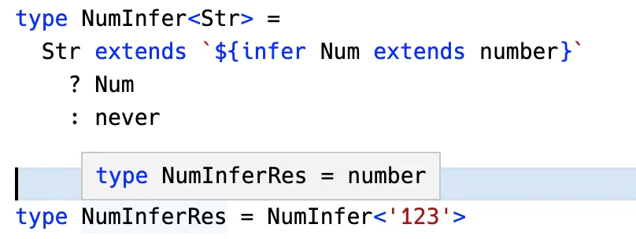

而 `4.8` 就是这样了：

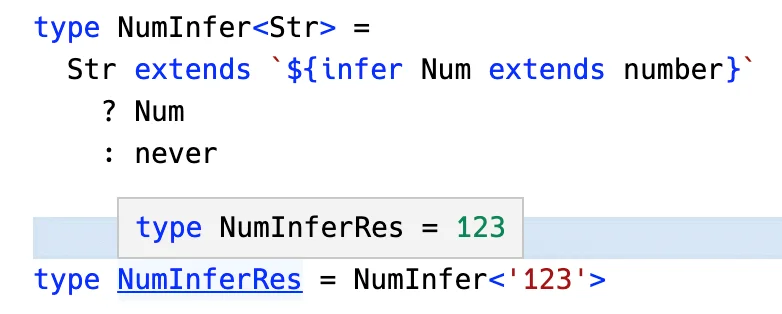

📚**也就是说 4.7 的时候推导出的就是 extends 约束的类型，但是 4.8 的时候，如果是基础类型，会推导出字面量类型。**

有了这个语法之后，除了能简化类型编程的逻辑之外，也能实现一些之前实现不了的功能：

比如提取枚举的值的类型：

```typescript
enum Code {
  a = 111,
  b = 222,
  c = 'xyz'
}
```

我们都是这样写：

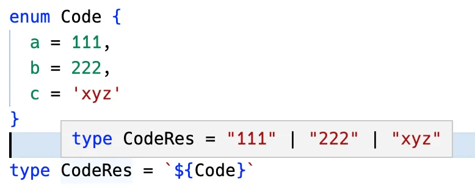

但是有的值明明是数字，却被作为了字符串，所以要再处理一下，转换成数字类型，这时候就可以用 infer extends 了：

```typescript
type StrToNum<Str> =
  Str extends `${infer Num extends number}`
    ? Num
    : Str
```

做完 string 到 number 的转换，就拿到了我们想要的结果：

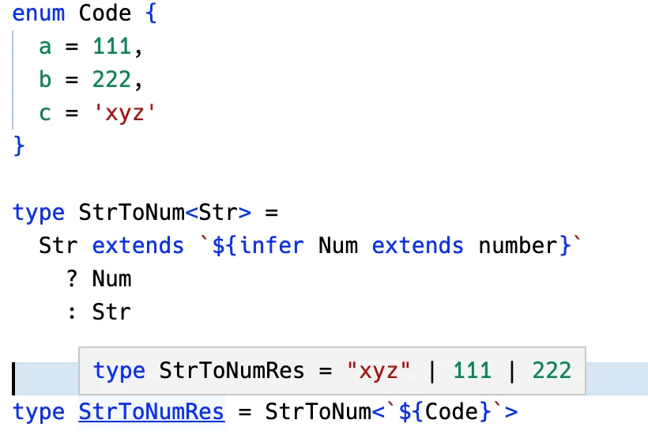

这就是 infer extends 的第二个作用。

📚**处理 string 转 number 之外，也可以转 boolean、null 等类型：**

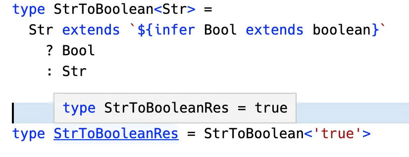

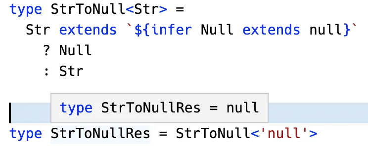


## 总结

Typescript 支持 infer 类型，可以通过模式匹配的方式，提取一部分类型返回。

但是 infer 提取出的类型是 `unknown`，后面用的时候需要类似和 string 取交叉类型，或者 `xxx extends string` 这样的方式来转换成别的类型来用。这样比较麻烦。

所以 `TS 4.7` 实现了 infer extends 的语法，可以指定推导出的类型，这样简化了类型编程。

而且，infer extends 还可以用来做类型转换，比如 string 转 number、转 boolean 等。

要注意的是，4.7 的时候，推导出的只是 extends 约束的类型，比如 number、boolean，但是 `4.8` 就能推导出字面量类型了，比如 1、2、true、false 这种。

有了 infer extends，不但能简化类型编程，还能实现一些之前很难实现的类型转换，是很有用的一个新语法。


- [TS4.7 extends Constraints on infer Type Variables](https://www.typescriptlang.org/docs/handbook/release-notes/typescript-4-7.html#extends-constraints-on-infer-type-variables)
- [TS4.8 Improved Inference for infer Types in Template String Types](https://www.typescriptlang.org/docs/handbook/release-notes/typescript-4-8.html#improved-inference-for-infer-types-in-template-string-types)

- 原文链接
  - [快速掌握 TypeScript 新语法：infer extends - @掘金](https://juejin.cn/post/7133438765317488677)

2023-03-16 11:22:05

