最近有两个同学问了我项目中遇到的 ts 问题，这俩问题都是典型的可以用类型编程来解决的。

这俩都是项目中真实遇到的问题，我们一起看一下吧：

## 案例1：如何利用索引签名扩展索引类型

第一个问题是这样的，项目中定义了接口返回的数据的类型，比如这样：

```typescript
type Data = {
  aaa?: number;
  bbb: {
    ccc: number;
    ddd: string;
  };
  eee: {
    ccc: {
      fff: number;
    }
  };
}
```

那么填充数据的时候就要根据类型的定义来写：

```typescript
const data: Data = {
  aaa: 1,
  bbb: {
    ccc: 1,
    ddd: 'aa',
  },
  eee: {
    ccc: {
      fff: 1,
    }
  }
}
```

但是呢，如果你想**扩展**一些属性就报错了：

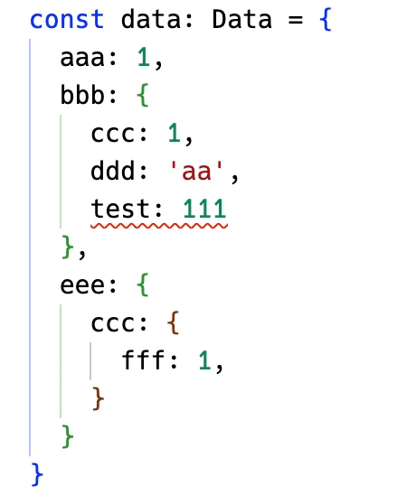


但现在**想每层都能灵活扩展一些属性**，怎么做呢？

简化一下就是这样的：

```typescript
type Obj = {
  a: number;
  b: string;
}

const obj: Obj = {
  a: 1,
  b: '2',
  c: 3 // [!code error]
}
```

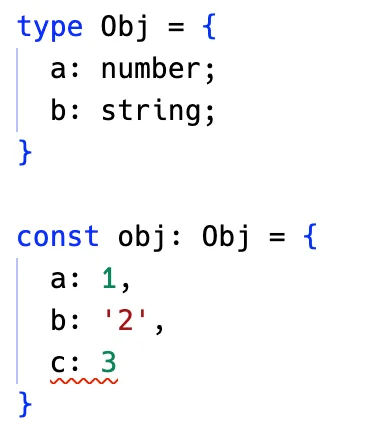


**如何能让这个索引类型可以灵活添加一些额外的索引呢？**

可以这样，添加一个可索引签名

```typescript {4,10-11}
type Obj = {
  a: number;
  b: string;
  [key: string]: any;
}

const obj: Obj = {
  a: 1,
  b: '2',
  c: 3,     // ✅
  d: 'test' // ✅
}
```

能满足这个索引签名的额外索引都可以添加。

也可以这样写：

```typescript {4}
type Obj = {
  a: number;
  b: string;
} & Record<string, any>

const obj: Obj = {
  a: 1,
  b: '2',
  c: 3,     // ✅
  d: 'test' // ✅
}
```

📚和 `Record<string, any>` 取交叉类型。

这个 Record 是一个内置的高级类型，作用是根据传入的 key 和 value 的类型生成索引类型：

```typescript
type Record<K extends string | number | symbol, T> = {
  [P in Key]: T
}
```

这种生成索引类型的语法叫做`映射类型`。

所以，`Record<string, any>` 就是这样的，也是一个有可索引签名的索引类型：

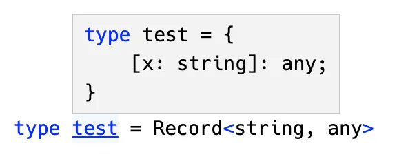


普通的对象我们知道怎么处理了，那多层的呢？

**这样任意层数的索引类型，怎么给每一层都加上 `Record<string, any>` 呢？**

```typescript
type Data = {
  aaa?: number;
  bbb: {
    ccc: number;
    ddd: string;
  };
  eee: {
    ccc: {
      fff: number;
    }
  };
}
```

🎉这时候就要用到递归了，可以这样写：

```typescript
type DeepRecord<Obj extends Record<string, any>> = {
  [Key in keyof Obj]:
    Obj[Key] extends Record<string, any> // 如果 Obj[Key] 仍是一个对象 则递归
      ? DeepRecord<Obj[Key]> & Record<string, any>
      : Obj{key}
} & Record<string, any>
```

- 定义一个 `DeepRecord` 的高级类型，传入的类型参数 Obj 为一个索引类型，通过 `Record<string, any>` 约束。
- 然后通过**映射类型**的语法构造一个新的索引类型。
- Key 来自之前的索引类型的 Key，也就是 Key in keyof Obj。
- Value 要判断是不是索引类型，如果依然是 `Record<string, any>`，那就**递归**处理它的值 Obj[Key]，否则直接返回 Obj[Key]。
- **每一层都要和 `Record<string, any>` 取交叉类型。**
- 这样就完成了递归让 Obj 的每一层都变得可扩展的目的。

我们测试一下：

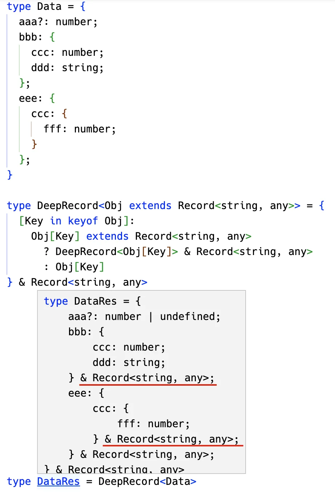

可以看到，处理过后的类型确实是每一层都加上了 `Record<string, any>`。

也确实每一层都可以扩展了：

```typescript {8,11,14}
type DataRes = DeepRecord<Data>

const data: DataRes = {
  aaa: 1,
  bbb: {
    ccc: 1,
    ddd: 'aa',
    test: 1111
  },
  eee: {
    test: '333',
    ccc: {
      fff: 1,
      test: true
    }
  }
}
```

并且有类型定义的索引也会做**类型检查**：

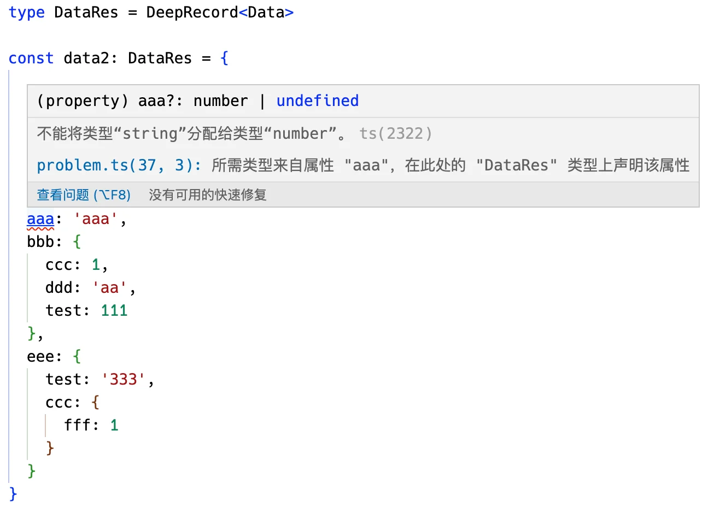


小结一下：**可索引签名可以让索引类型扩展任意数量的符合签名的索引，如果想给任意层级的索引每层都加上可索引签名就要递归处理了。**

那如果不用类型编程呢？

那你就要原封不动的写一个新的索引类型，然后手动给每一层都加上可索引签名，那就麻烦太多了，而且也不通用。

这就是类型编程的意义之一，可以根据需要修改类型。

- [TS Playground](https://www.typescriptlang.org/play?#code/C4TwDgpgBAIghsOUC8UDeAoK2pzwLigDsBXAWwCMIAnAbixwqcMxzagGMvDTKb72OACYjCAZ2DUAlkQDmAnAF8ANA2wQNLNewBme8ZJnztbEUJ7kqdbYoy3QkWBrAAlCBwD21IQB4A8hQAVlAQAB7AEERCYlBunt4+EtJyyrhEIAB8GSjo2gDaANIQIFAyUADWxR46UAGBALqEJjh1hcX1IeGR0bHuXr5JRqlw6RnNggD8ThCufQmtRSD12QBkvfEDhilpmePshAvtdlBrcf2JW7LDo-QYDtDUEDGoMM5nCfCIGbeeRBJQQgQcEInyQqFYODwwKgAEZVGwmBQtIJsFwOIQ4XszIQAORQnE2eE4DQQZEovQ6XGInFEwTYqAAJhsdiAA)

## 案例2：动态生成多种枚举

再来看第二个问题：

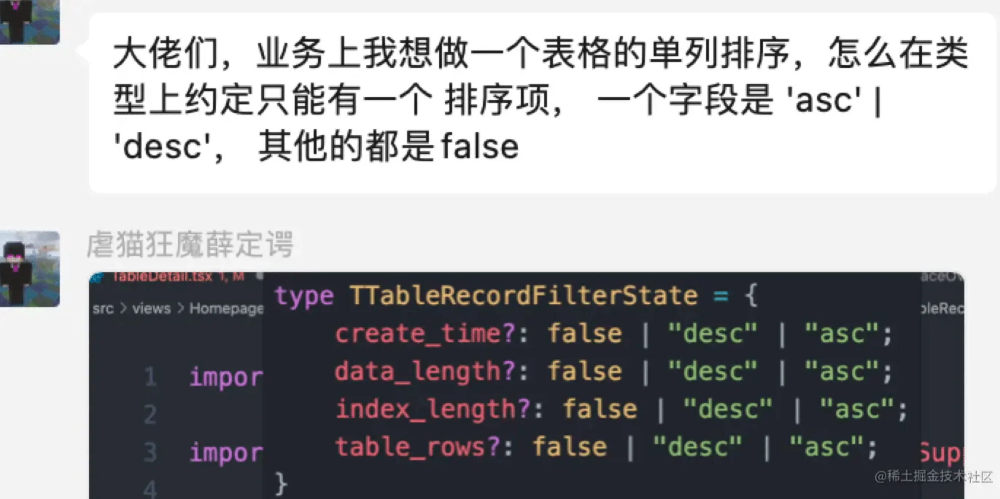


**也就是当一个索引为 `'desc' | 'asc'` 的时候，其他索引都是 `false`。**

这种类型怎么写呢？

有的同学说，这个就是枚举所有的情况呀，比如这样：

```typescript
type test = 
  | {
    aaa: 'desc' | 'asc',
    bbb: false,
    ccc: false,
    ddd: false
  }
  | {
    aaa: false,
    bbb: 'desc' | 'asc',
    ccc: false,
    ddd: false
  }
  | {
    aaa: false,
    bbb: false,
    ccc: 'desc' | 'asc',
    ddd: false
  }
  | {
    aaa: false,
    bbb: false,
    ccc: false,
    ddd: 'desc' | 'asc'
  }
```

这确实能解决问题：

```typescript
// ✅
const aa: test = {
  aaa: 'asc',
  bbb: false,
  ccc: false,
  ddd: false
}

// ✅
const bb: test =  {
  aaa: false,
  bbb: 'desc',
  ccc: false,
  ddd: false
}

// ❌ 类型不符合
const cc: test = { // [!code error]
  aaa: 'asc',
  bbb: 'desc',
  ccc: false,
  ddd: false
}
```

可以看到类型检查是符合我们的需求的。

但如果我再加几个属性呢？

是不是可能的类型又多了几种？

**手动维护也太麻烦了！** 😅

这时候就可以**用类型编程动态生成**了。

比如我定义这样一个高级类型：

```typescript
type GenerateType<Keys extends string> = {
  [Key in Keys]: {
    [Key2 in Key]: 'desc' | 'asc'
  }
}
```

它生成的类型是这样的：

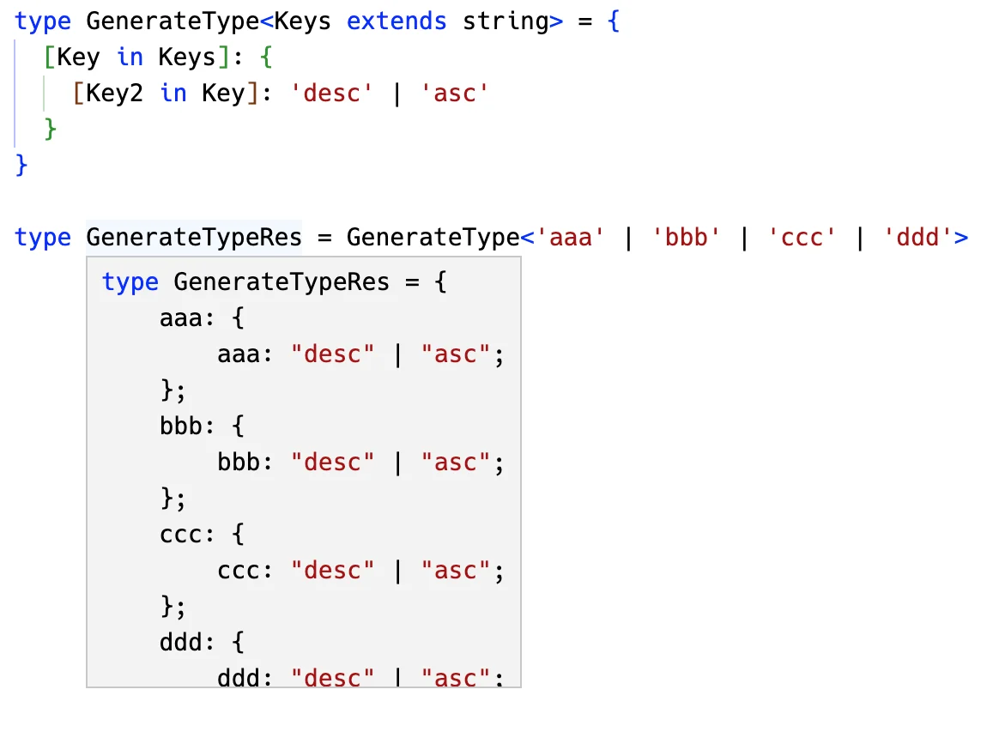

这个还是很容易理解的，**映射类型就是用来生成索引类型的**。

🎉我们`可以取它的值`：

```typescript
type GenerateType<Keys extends string> = {
  [Key in Keys]: {
    [Key2 in Key]: 'desc' | 'asc'
  }
}[Keys]
```

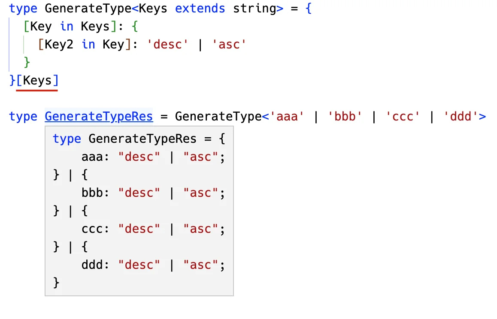

🤔现在就只差那些为 false 的索引了。

Keys 是一个联合类型，从中去掉 Key 的类型，可以用 `Exclude`，也就是 `Exclude<Keys, Key>`。

那么这个类型就可以这么写：

```typescript
type GenerateType<Keys extends string> = {
  [Key in Keys]: {
    [Key2 in Key]: 'desc' | 'asc'
  } & {
    [Key3 in Exclude<Keys, Key>]: falase
  }
}[Keys]
```

结果就是我们要的类型：

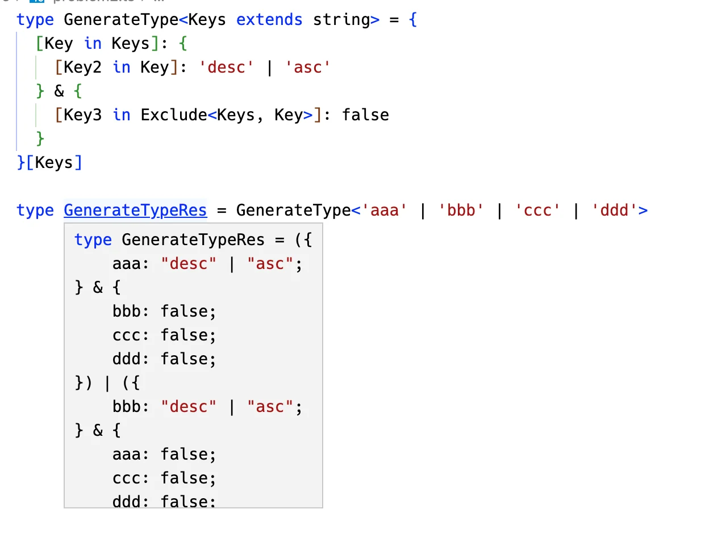

任意多个索引都可以动态生成复合需求的联合类型。

```typescript
type res = GenerateType<'aaa' | 'bbb' | 'ccc'>

// ✅
const aa: test = {
  aaa: 'asc',
  bbb: false,
  ccc: false,
}

// ✅
const bb: test =  {
  aaa: false,
  bbb: 'desc',
  ccc: false,
}

// ❌ 类型不符合
const cc: test = { // [!code error]
  aaa: 'asc',
  bbb: 'desc',
  ccc: false,
  ddd: false
}
```

上面这个高级类型还可以做一些优化，把 key 的约束换成 `keyof any`：

```typescript
type GenerateType<Keys extends string> = { // [!code --]
type GenerateType<Keys extends keyof any> = { // [!code ++]
  [Key in Keys]: {
    [Key2 in Key]: 'desc' | 'asc'
  } & {
    [Key3 in Exclude<Keys, Key>]: falase
  }
}[Keys]
```

`keyof any` 的结果就是索引的类型：

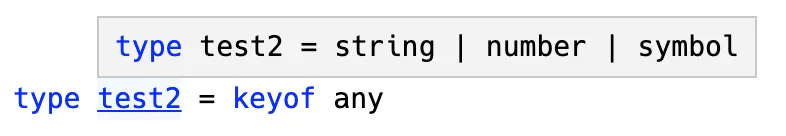

但有个配置项叫做 `keyofStringsOnly`

::: warning

该配置项为了兼容老的TS版本，基本上已不再使用，这里仅为了说明。在TS Playground中进行配置

:::

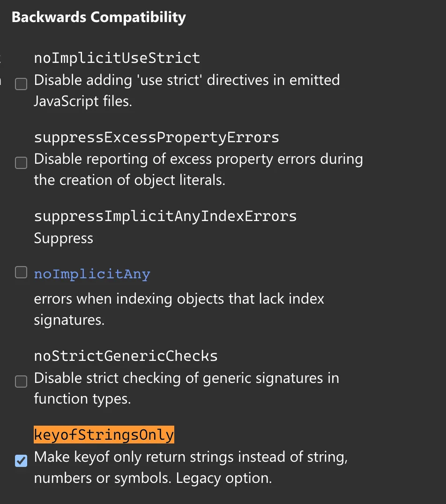

开启之后就只能是 string 作为 key 了：

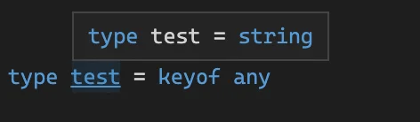


`keyof any` 就可以动态获取 key 的可能类型，比写死更好。

这个高级类型最终就是这样的：

```typescript
type GenerateType<Keys extends keyof any> = {
  [Key in Keys]: {
    [Key2 in Key]: 'desc' | 'asc'
  } & {
    [Key3 in Exclude<Keys, Key>]: falase
  }
}[Keys]
```

::: tip

评论区小伙伴给出了另一种方案感觉更精简：利用了 [联合类型的distributive特性](./9)

```typescript
type Keys = 'a' | 'b' | 'c' | 'd'
type OneInAll<
  loopKeys extends keyof any,
  originalKeys extends keyof any = loopKeys
> =
  loopKeys extends loopKeys
    ? {
      [P in originalKeys]: P extends loopKeys ? 'desc' | 'asc' : false
    }
    : never

type OneInAllRes = OneInAll<Keys>
```

:::


小结一下：**当需要枚举很多种类型的可能性的时候，可以用类型编程动态生成。**

那如果不用类型编程呢？

那你就得手动维护所有的可能类型了。

这就是类型编程的第二个意义，可以动态生成类型。

- [TS Playground](https://www.typescriptlang.org/play?#code/C4TwDgpgBA4hB2EBOBDYEAq4IB4DSEIAzlBAB7rwAmJA1oQPYBmUK8IAfFALxQDeAKCjCoAbQIgoAS3hQJRALoAufkJHrxhAEzTZE5VADkVCEQDGhqAB8jKc4bXCAvlABkq9RokBmXVACiZGYANgCuJviERAA0coQcBkwowUQQjlBOAk6axAoA3AICoJBQSKY8sAjIaJjYOIYojZY2hgBG7c1GZt2GHAUCZgzwRMCsSmUkvILqjSgqDfbR6e2tKkkpEEvq3WZryalZhYPDo6ul5VPps3sbWyIr8yaL6Ts3B5kDQyNQu+eTHiJrrZnuoHkYnhY7sJXlB1u8BEA)

## 总结

通过这两个真实的案例，不知道你是否体会到类型编程解决了什么问题呢？

**当你需要修改已有的类型，或者动态生成类型，都可以用类型编程。**

第一个案例，我们递归给每一层加上了可索引签名，不需要手动一层层改。

第二个案例，我们动态生成了所有的可能类型，不需要手动枚举。

类型编程的意义，你感受到了么？


原文地址：

- [项目中 2 个真实的 TS 类型编程案例 - 神光@掘金](https://juejin.cn/post/7181846488937398309)


2023年03月21日10:52:18