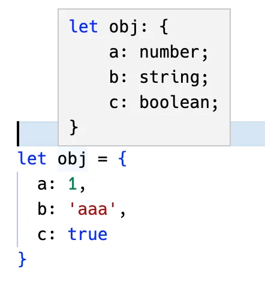

用了 TypeScript 之后，我们就可以声明类型，然后给 js 变量加上这个类型。

比如这样：就有**类型提示**了


也会做**类型检查**：


但也不是所有的变量都要**手动声明类型**，因为 ts 会做自动类型推导：



同样是有类型提示和检查的：


而且推导的时候还可以加上 `as const`，这样推导出的是**字面量类型**（不过会有 `readonly` 的修饰）：


🤔那问题来了，**什么时候手动声明类型，什么时候用自动推导呢？**

比如上面这个 obj，b 属性推导出的是 string，但其实也可能是一个 number。但给它赋值 number 会报错：


这种就得手动声明类型了：


还有，函数的参数，只有调用的时候才能知道参数具体的类型，这时候怎么自动推导？

没办法推导。

所以也得手动声明类型：


总之，**ts 代码包括自动推导出的类型、手动声明的类型两种。**

自动类型推导省去了很多写类型的麻烦，但很多情况下还是要手动声明类型的。

但手动声明的类型是有局限性的，比如这样的类型：

- `key:string` 那部分是索引签名，也就是任意的 key 为 string，value 为任意类型的索引都可以加。

它是可以检查出类型错误，也支持扩展任意索引。


但它只会提示声明的索引，**动态添加**的那些是不会提示的：


这样其实有的时候并不方便。

而如果自动推导呢？


这样就可以提示所有的索引了。

但是呢，其中 `b` 的类型又不对，还是需要声明类型来约束。

是不是就很头疼？😅

**用声明的方式少了具体赋值的变量类型的信息，用自动推导的方式又不能保证类型是对的。**

有没有两全其美的办法呢？

4.9 之前还真没有。

不过 `TS v4.9` 加入了一个 `satisfies` 的新语法。

这样用：


不需要给变量声明这个类型了，用自动推导出来的类型，这样提示就是根据具体的值来的。

而且，还有了声明的方式的类型检查😎。


是不是两全其美！

这就是为什么 ts 要增加 `satisfies` 这个语法。

它的作用就是**让你用自动推导出的类型，而不是声明的类型，增加灵活性，同时还可以对这个推导出的类型做类型检查，保证安全。**

但是，`satisfies` 的方式也有它的问题，比如这里用了推导出的类型：


**那就不能动态扩展索引了：**


而如果是声明的那种索引签名，是支持扩展的😅：


所以，具体什么时候用声明的类型，什么时候用推导出的类型 + `satisfies`，还是要看情况的。

这个新语法还是很有用的，估计以后在代码里会经常看到。


## npm 查看版本命令tips

::: info

原文写作时间是在 `typescript v4.9` 发布之前，而目前ts已经 `v5.0.2`了， 因此下面内容和原文有所不同。

:::

可使用 `npm dist-tag ls` 查看npm包最新版本和beta版本，而 `npm view [package] versions --json` 可以查看package所有版本


可以看出typescript目前最新版本是 `v5.0.2`，因此使用 `satisfies` 完全是没有问题的。

说点题外话，这个 tag 是怎么打上的呢？

发包的时候会用 npm publish，这种会自动打上 latest 的 tag。

也可以手动 `npm publish --tags beta`，这样打的就是 beta 的 tag了。

除了发包的时候可以指定 tag，平时也可以通过 npm dist-tag 命令来给某个版本的包打上 tag：


## 总结

TypeScript 中变量的类型有两种，一种是手动声明的，一种是自动推导的。

- 大多数情况下，不用手动声明类型，用自动推导的就行，比较方便。

- 但像函数参数、需要约束的变量类型等情况下就得手动声明了。

- 有的时候还是自动推导出的类型更合适一些，但是还需要通过声明的方式对其中的类型做约束。

不能两全其美。

所以 ts 加入了 `satisfies` 的语法，这样就可以用自动推导出的类型了，它也可以加上类型的约束🎉。

**算是融合了自动推导的类型和手动声明的类型的优点。**

我是用手动声明的类型，还是自动推导的类型 + satiesfies 呢？这是个问题。


::: tip

另外npm相关的2个命令 ：

```bash
# 显示最新版本，beta版本，rc， next版本
npm dist-tag ls [package]

# 显示package所有版本
npm view [package] versions --json
```

:::


原文链接：

- [TypeScript 新语法 satisfies：用声明还是用推导？这是个问题 - 神光@juejin](https://juejin.cn/post/7186991340347981882)
- [TypeScript satisfies Operator - TS Docs](https://www.typescriptlang.org/docs/handbook/release-notes/typescript-4-9.html#the-satisfies-operator)


2023年03月20日10:14:09

