TypeScript 类型编程的代码看起来比较复杂，但其实这些逻辑用 JS 大家都会写，之所以到了类型体操就不会了，那是因为还不熟悉一些套路。

所以，这节开始我们就来学习一些类型体操的套路，熟悉这些套路之后，各种类型体操逻辑就能够很顺畅的写出来。

首先，我们来学习类型体操的第一个套路：模式匹配做提取。


## 模式匹配

我们知道，字符串可以和正则做模式匹配，找到匹配的部分，提取子组，之后可以用 1,1,2 等引用匹配的子组。

```js
'abc'.replace('/a(b)c/)', '$1,$1,$1')
// 得到
// 'b,b,b'
```

Typescript 的类型也同样可以做模式匹配。

比如这样一个 Promise 类型：

```typescript
type p = Promise<'guang'>
```

我们想提取 value 的类型，可以这样做：

```typescript
type GetValueType<P> = P extends Primise<infer Value> ? Value : never
```

通过 extends 对传入的类型参数 P 做模式匹配，其中值的类型是需要提取的，通过 infer 声明一个局部变量 Value 来保存，如果匹配，就返回匹配到的 Value，否则就返回 never 代表没匹配到。

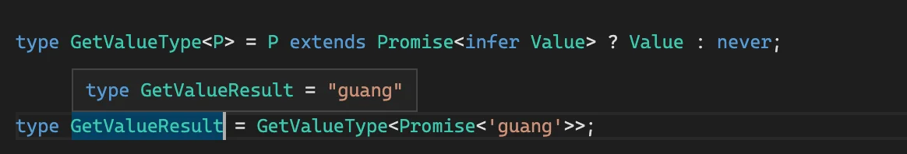

- [TS Playground](https://www.typescriptlang.org/play?#code/FAFwngDgpgBA4lEA1AhgGwK5QCqSgHgAUA+GAXhkJigA8QoA7AEwGdKAnAewFsBLFgrwYAzKOxipMUUgH4J6LDABcMBlABuYgNzBd4aPESSsAJSgsMaEOUPIFOPES58B+AOQBzDCgYe3xYi0gA)

::: tip

TSv4.5版本引入了 [Awaited\<Type>](https://www.typescriptlang.org/docs/handbook/utility-types.html#awaitedtype) 实现了上面类似的功能

``` typescript
type GetValueResult = Awaited<Promise<'guang'>>
```

:::

这就是 Typescript 类型的模式匹配：

**📚 Typescript 类型的模式匹配是通过 `extends` 对类型参数做匹配，结果保存到通过 `infer` 声明的局部类型变量里，如果匹配就能从该局部变量里拿到提取出的类型。**

这个模式匹配的套路有多有用呢？我们来看下在数组、字符串、函数、构造器等类型里的应用。


## 数组类型


### First

数组类型想提取第一个元素的类型怎么做呢？

```typescript
type arr = [1,2,3]
```

用它来匹配一个模式类型，提取第一个元素的类型到通过 infer 声明的局部变量里返回。

``` typescript
type GetFirst<Arr extends unknown[]> = 
	Arr extends [infer First, ...unknown[]] ? First : never
```

::: tip

**`any` 和 `unknown` 的区别**： 

- any 和 unknown 都代表任意类型，但是 unknown 只能接收任意类型的值，而 any 除了可以接收任意类型的值，也可以赋值给任意类型（除了 never）。类型体操中经常用 unknown 接受和匹配任何类型，而很少把任何类型赋值给某个类型变量。

:::

对 Arr 做模式匹配，把我们要提取的第一个元素的类型放到通过 infer 声明的 First 局部变量里，后面的元素可以是任何类型，用 unknown 接收，然后把局部变量 First 返回。

当类型参数 Arr 为 [1,2,3] 时：

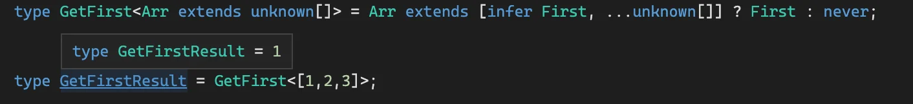

当类型参数 Arr 为 [] 时：

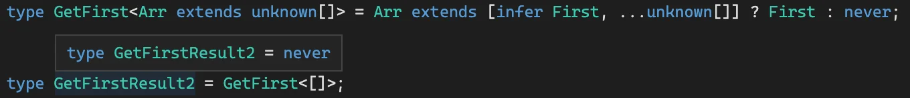

- [TS Playground](https://www.typescriptlang.org/play?#code/C4TwDgpgBA4hwDECWAnAzsAPAQRSqEAHsBAHYAmaUArqQNakD2A7qQNoC6AfFALxS58REhSpskpAGYR8ydMAA0UAHSraDFuw4coAfihyMUAFxRSEAG4yA3ACh7oSLHiHgAJQhpqAG2B9niKgYmGwAjAoATAoAzNx2to7QcIHyHl6+Ef7JriFxtkA)


### Last

可以提取第一个元素，当然也可以提取最后一个元素，修改下模式类型就行：

```typescript
type GetLast<Arr extends unknown[]> =
  Arr extends [...unknown[], infer Last] ? Last : never;

// type GetLastResult = 3
type GetLastResult = GetLast<[1, 2, 3]>

// type GetLastResult = never
type GetLastResult = GetLast<[]>
```

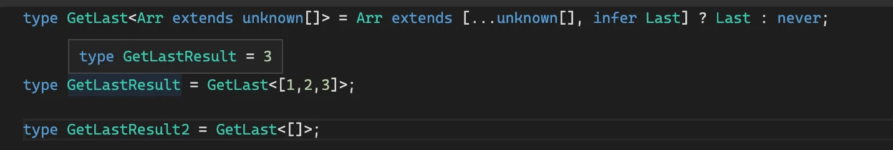


### PopArr

我们分别取了首尾元素，当然也可以取剩余的数组，比如取`去掉了最后一个元素`的数组：

```typescript
type PopArr<Arr extends unknown[]> =
  Arr extends []
    ? []
    : Arr extends [...infer Rest, unknown] 
      ? Rest : never

// type PopResult = [1, 2]
type PopResult = PopArr<[1, 2, 3]>

// type PopResult = []
type PopResult2 = PopArr<[]>
```

如果是空数组，就直接返回，否则匹配剩余的元素，放到 infer 声明的局部变量 Rest 里，返回 Rest。

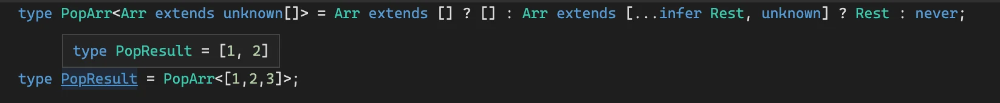

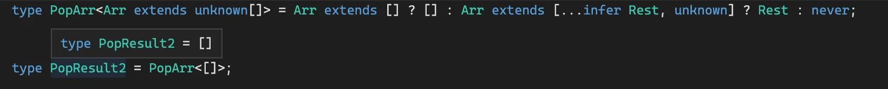


- [TS Playground](https://www.typescriptlang.org/play?#code/C4TwDgpgBACg9mAggJ2QHhcqEAewIB2AJgM5QCuBA1gXAO4EDaAugHxQC8Um2ehpUFlAD8g5lABc3VL3zEyjAHTKAlgQBmELACUIJYABoK1Wg3Gjd+yVAIQAbloDcAKFehIsBJfIAbYJ08kVDRGAEYDACYDAGY2FzdwaHgwbz8IgOTMELigA)


### ShiftArr

同理可得 ShiftArr 的实现（去掉第一个元素）：

```typescript
type ShiftArr<Arr extends unknown[]> =
  Arr extends []
    ? []
    : Arr extends [unknown, ...infer Rest]
      ? Rest
      : never

// type ShiftResult = [2, 3]
type ShiftResult = ShiftArr<[1, 2, 3]>

// type ShiftResult2 = []
type ShiftResult2 = ShiftArr<[]>
```

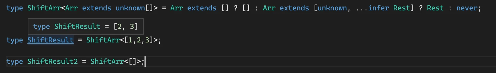

- [TS Playground](https://www.typescriptlang.org/play?#code/FAFwngDgpgBAygCwJYDMQEEBOmA8XMxQAeIUAdgCYDOMArmQNZkD2A7mQNoC6AfDALwx8hEuWoxuMAPwSuMAFxDsI0pRod6TNmQA0MAHSGkZFFAIAlKFRByZl6wphkoANzMBuYF-DR4yNPa0ADYgAn6oGNg4HACMOgBMOgDMvJ6gkLCIEYEh8WFZaPjRqUA)


## 字符串类型

字符串类型也同样可以做模式匹配，匹配一个模式字符串，把需要提取的部分放到 `infer` 声明的局部变量里。


### StartsWith

判断字符串是否以某个前缀开头，也是通过模式匹配：

```typescript
type StartsWith<Str extends string, Prefix extends string>
	= Str extends `${Prefix}${string}` ? ture : false;


// type StartsWithResult = true
type StartsWithResult = StartsWith<'guang and dong', 'guang'>

// type StartsWithResult2 = false
type StartsWithResult2 = StartsWith<'guang and dong', 'dong'>
```

需要声明字符串 Str、匹配的前缀 Prefix 两个类型参数，它们都是 string。

用 Str 去匹配一个模式类型，`模式类型的前缀是 Prefix，后面是任意的 string`，如果匹配返回 true，否则返回 false。

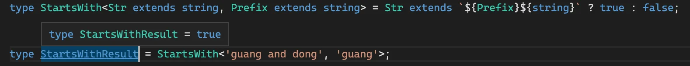

- [TS Playground](https://www.typescriptlang.org/play?#code/C4TwDgpgBAysCGAnYBnA6gS2ACwDx0SggA9gIA7AExShWEQ3IHMAaKABUQgDMNijSFarXqMmAPigBeWPQFkqNAAYASAN6cefAL7q6DZtqVQA-FHoBXaAC4o3eABsUEANwAoD6EiykqTDgAlCBQLB2BpH2R0LDwAciYLeGYoJMooSgB7Zli2eMTs8XcPNy9oOF9owODQ4AAmCPKo-ziEpKYUqnSsphyoWMyClyA)


### Replace

字符串可以匹配一个模式类型，提取想要的部分，自然也可以用这些再构成一个新的类型。

比如实现字符串替换：

```typescript
type Replace<
  Str extends string,
  From extends string,
  To extends string
> = Str extends `${infer Prefix}${From}${infer Suffix}` 
	? `${Prefix}${To}${Suffix}` 
	: Str;

// 匹配上
type ReplaceResult = ReplaceStr<"Guangguang's best friend is ?", "?", "Dongdong">

// 没匹配上
type ReplaceResult2 = ReplaceStr<"abc", "?", "Dongdong">;
```

声明要替换的字符串 Str、待替换的字符串 From、替换成的字符串 3 个类型参数，通过 extends 约束为都是 string 类型。

用 Str 去匹配模式串，模式串由 From 和之前之后的字符串构成，把之前之后的字符串放到通过 infer 声明的局部变量 Prefix、Suffix 里。

用 Prefix、Suffix 加上替换到的字符串 To 构造成新的字符串类型返回。

当匹配时：

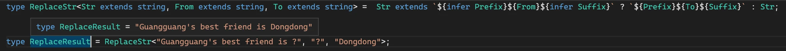

没匹配上，返回原字符串：

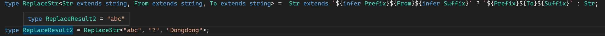

- [TS Playground](https://www.typescriptlang.org/play?#code/C4TwDgpgBAShYBsCGBjCBlYAnAPJrUEAHsBAHYAmAzlFdgJZkDmANFAGJYD2AtoSeWq0GzNgBUu-UpRp0sjJgD4oAXihR8UwTQAGAEgDejAGYQCABSwRj9IgF9DnXg6NlTBdAFdjN+zqgA-FD6BpbWti4SLl4+Ef4AXBrYANwAUOmpoJCw8MhocFSeCMCqOYioGNg4AEQA4p5IzEwNzADkNABGEHRQxvKCUPQ0AdVs1SNjACJczBQzTNWKaZng0HDl+d1FwABMpet5lbjVSB0oo1DjF9XTs-OLyUA)


### Trim

能够匹配和替换字符串，那也就能实现去掉空白字符的 Trim：

不过因为我们不知道有多少个空白字符，所以只能一个个匹配和去掉，需要递归。

先实现 `TrimRight`:

``` typescript
type TrimStrRight<Str extends string> =
  Str extends `${infer Rest}${' ' | '\n' | '\t'}`
    ? TrimStrRight<Rest>
    : Str;

// type TrimRightResult = 'guang'
type TrimRightResult = TrimStrRight<'guang   '>
```

类型参数 Str 是要 Trim 的字符串。

如果 Str 匹配字符串 + 空白字符 (空格、换行、制表符)，那就把字符串放到 infer 声明的局部变量 Rest 里。

把 Rest 作为类型参数递归 TrimRight，直到不匹配，这时的类型参数 Str 就是处理结果。

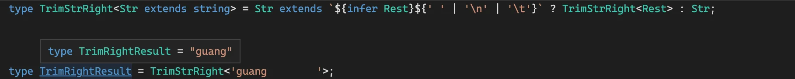


同理可得 `TrimLeft`：

```typescript
type TrimStrLeft<Str extends string> =
  Str extends `${' ' | '\n' | '\t'}${infer Rest}`
    ? TrimStrLeft<Rest>
    : Str;

// type TrimRightResult = 'guang'
type TrimLeftResult = TrimStrLeft<'  guang'>
```

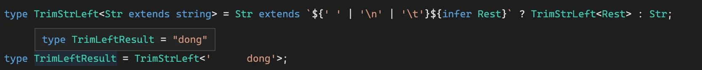

TrimRight 和 TrimLeft 结合就是 `Trim`：🎉

```typescript
type TrimStr<Str extends string> =TrimStrRight<TrimStrLeft<Str>>
```

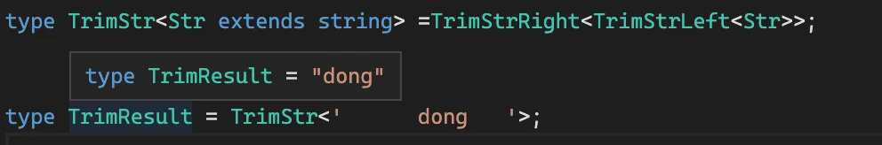


- [TS Playground](https://www.typescriptlang.org/play?#code/C4TwDgpgBAKgTgSwLYGVhwEoIOYAtgA8acUEAHsBAHYAmAzlHegldgHxQC8UxpF19KAAMAJAG8WAMwgkMEJgF9xAciiqAPmoA6VDduDKFQqAH5YiVOix5CcphwBcPdAG4AUB7ehI55Nfx2AK4ANsBcvpaYOPgEytiBAIasUCmpKcps7h7e0PDIxAAyEJKEvOSUtAxMiKwc3GX8lcIqalCayjp6HQZKElTSsvLARqYRhcW2Q47OcFle4LkWRSVBoeF5kcuEqmlQNAD2rBlz2Qtj6ETofBWC1SzsXBvE-oRP6FuXcGyZnjkRq2FuG84LFdntDthUsc3EA)


## 函数

函数同样也可以做类型匹配，比如提取参数、返回值的类型。


### GetParameters

函数类型可以通过模式匹配来提取参数的类型：

```typescript
type GetParameters<Func extends Function> = 
	Func extends (...args: infer Args) => unknown ? Args : never;

// 返回一个元祖类型
// type ParametersResult = [name: string, age: number]
type ParametersResult = GetParameters<(name: string, age: number) => string>;
```

类型参数 Func 是要匹配的函数类型，通过 extends 约束为 Function。

Func 和模式类型做匹配，参数类型放到用 infer 声明的局部变量 Args 里，返回值可以是任何类型，用 unknown。

返回提取到的参数类型 Args。

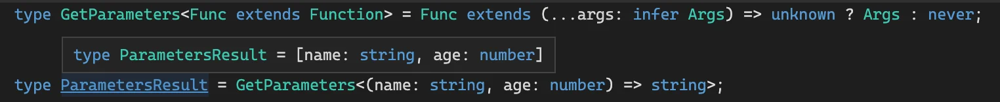


- [TS Playground](https://www.typescriptlang.org/play?#code/C4TwDgpgBA4hwAUCGAnJBbeEUGcA8AYgK4B2AxlBAB7AQkAmOUx5wAlgPYkB8UAvM1IVqtBkwAUAOmmoA5jgBcUNiQBm2KAEEU8gJT9epANYkOAdxJQA-Fp1MlJCADdsAbgBQn0JCjI0mWlwAJQgcIgAbYH5YeD8MLFw8cRJ4pRxgFBVZABooJFkIByJ0ACNsfT5edMySWW4Pd29oOIDsHBCwyIAmaLhEVHjA-HEKqoys+qA)

::: tip

TS3.1 添加了 [Paramters\<Type>](https://www.typescriptlang.org/docs/handbook/utility-types.html#parameterstype) 类似功能。

:::


### GetReturnType

能提取参数类型，同样也可以提取返回值类型：

``` typescript
type GetReturnType<Func extends Function> = 
  // 这里参数用的是any
  Func extends (...args: any[]) => infer R ? R : never

// type Result = 'dong'
type Result = GetReturnType<() => 'dong'>
```

Func 和模式类型做匹配，提取返回值到通过 infer 声明的局部变量 ReturnType 里返回。

参数类型可以是任意类型，也就是 `any[]`（🚨注意，这里不能用 unknown，这里的解释涉及到参数的逆变性质，具体原因逆变那一节会解释）。


- [TS Playgroundd](https://www.typescriptlang.org/play?#code/C4TwDgpgBA4hwCV4FcBOA7AKuCAeAYsugMZQQAewE6AJgM5SEnACWA9ugHxQC8jRpClVoMAFADpJAQ1QBzOgC4oU9CADaAXQCUvbi3QAzCKihJgaLDigB+UygzZIUJeggA3YwG4AUN9BOzC0cIJDpkABtw4F5YeECHHFxRdCkAWwglOmBUfVkdHm4AchoOWULOTyA)

::: tip

TS工具类型 [ReturnType\<Type>](https://www.typescriptlang.org/docs/handbook/utility-types.html#returntypetype)

:::

### GetThisParameterType

方法里可以调用 `this`，比如这样：

```js
class Dong {
    name: string;

    constructor() {
        this.name = "dong";
    }

    hello() {
        return 'hello, I\'m ' + this.name;
    }
}

const dong = new Dong();
dong.hello();
```

用`对象.方法名`的方式调用的时候，this 就指向那个对象。

但是方法也可以用 call 或者 apply 调用：

```typescript
class Dong {
    name: string;

    constructor() {
        this.name = "dong";
    }

    hello() {
        return 'hello, I\'m ' + this.name;
    }
}

const dong = new Dong();
dong.hello();

dong.hello.call({xxx: 1}) // [!code ++]
```

call 调用的时候，this 就变了，但这里却没有被检查出来 this 指向的错误。

如何让编译器能够检查出 this 指向的错误呢？

可以在方法声明时指定 this 的类型：

```typescript
class Dong {
  name: string

  constructor(name: string) {
    this.name = name
  }

  hello() { // [!code --]
  hello(this: Dong) { // [!code ++]
    return 'Hello, I\'m ' + this.name
  }
}

const dong = new Dong('dong')
dong.hello()

dong.hello.call({xxx: 1}) // [!code error]
```

这样，当 call/apply 调用的时候，就能检查出 this 指向的对象是否是对的：

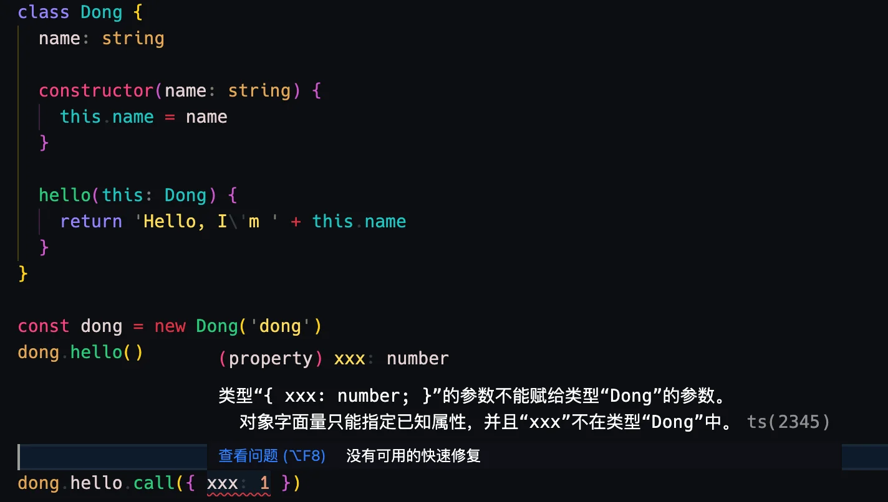

如果没有报错，说明没开启 strictBindCallApply 的编译选项，这个是控制是否按照原函数的类型来检查 bind、call、apply

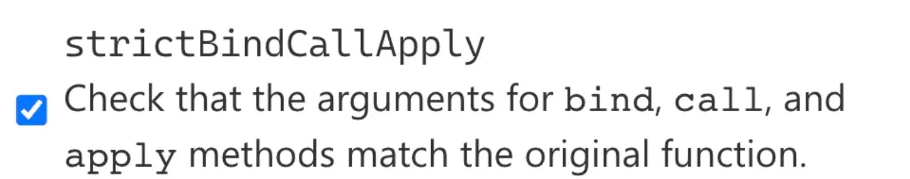

这里的 `this` 类型同样也可以通过模式匹配提取出来：

```typescript
type GetThisParameterType<T>
  = T extends (this: infer ThisType, ...args: any[]) => any
      ? ThisType
      : unknown;
```

类型参数 T 是待处理的类型。

用 T 匹配一个模式类型，提取 this 的类型到 infer 声明的局部变量 ThisType 中，其余的参数是任意类型，也就是 any，返回值也是任意类型。

返回提取到的 ThisType。

这样就能提取出 this 的类型：

```typescript
type GetThisParameterTypeRes = GetThisParameterType<typeof dong.hello>
```

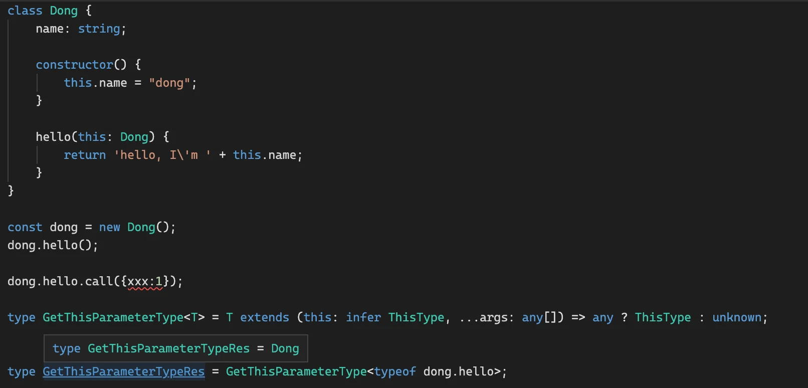


- [TS Playground](https://www.typescriptlang.org/play?#code/MYGwhgzhAEAiD2A7A5tA3gKGt6iwFsBTALmggBcAnASxQG4MsdgkLKBXYc+SgCgEp0THDnIALahAB0eItAC80AEQATJMiUMRAX0YixhECHi9xk0ghSDMIkZULl2lRNADkBo-AA00AJIAdV3w3aABqaDNpWUItHF1dDBZECmg1FAVcQgB3OHUBBjTkKQ9jfMZC4sNjKWAwI140AA9m4gBGbX4GDHIATwAHQmgAcQcAFQkIAAUwSgIHQkpR-sIAHlGAPgzR6EJG8kJEFRhTCdJaADMF6HHJJYGfKUeZ5AhSMEQegG0AXUF5TfePWgAH5rhM7oNSOxEABrRDwLKILrdZbDMYTaazIj7RbLABKhBgihG5BuUxmcxxEJWvQG8HOqXUlU862RQA)

::: tip

TS中存在 [ThisParameterType\<Type>](https://www.typescriptlang.org/docs/handbook/utility-types.html#thisparametertypetype) 工具类型

:::

## 构造器

构造器和函数的区别是，构造器是用于创建对象的，所以可以被 `new`。

同样，我们也可以通过模式匹配提取构造器的参数和返回值的类型：


### GetInstanceType

构造器类型可以用 interface 声明，使用 `new(): xx` 的语法。比如：

``` typescript {6}
interface Person {
  name: string;
}

interface PersonConstructor {
  new(name: string): Person
}
```

这里的 PersonConstructor 返回的是 Person 类型的实例对象，这个也可以通过模式匹配取出来。

```typescript
type GetInstanceType<
  Ctor extends new (...args: any[]) => any
> = Ctor extends new (...args: any[]) => infer InstanceType
      ? InstanceType
      : any

type GetInstanceTypeRes = GetInstanceType<PersonConstructor>
```

类型参数 ConstructorType 是待处理的类型，通过 extends 约束为构造器类型。

用 ConstructorType 匹配一个模式类型，提取返回的实例类型到 infer 声明的局部变量 InstanceType 里，返回 InstanceType。

这样就能取出构造器对应的实例类型：

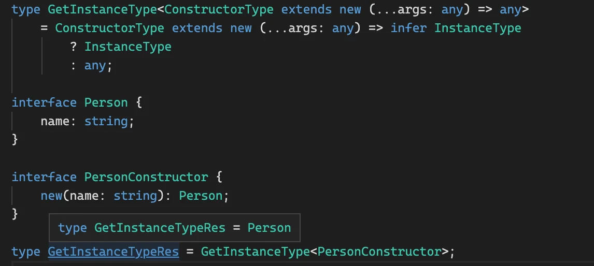

- [TS Playground](https://www.typescriptlang.org/play?#code/C4TwDgpgBA4hwEkB2BnYBDJBjCAVcEAPAMID2qwATgK5bCmX6RQQAewESAJilEhAHcoACgB049JQDmKAFxRMIAJRQAvAD4FSEJoBQUA2qhkKNOgybQ2Hbr35CxE6XK3K1mgJZIAZhEpRkNEwcSyh9QwiAfgCKYLwCMIiI+UUAbl1dLw5Kb3QcKAAFPxRyKABvcIMkdABbCHk0Si8pdIBfDKy-XPyiyhKkE0baen8KiPtharqGqmaleV7+tozQZjhEWOx4yAAlCF5VWHhAjC3LQkXyQaphhnV0oA)

::: tip

TS存在 [InstanceType\<Type>](https://www.typescriptlang.org/docs/handbook/utility-types.html#instancetypetype) 工具类型

:::


### GetConstructorParameters

GetInstanceType 是提取构造器返回值类型，那同样也可以提取构造器的参数类型：

``` typescript
type GetConstructorParameters<
  Ctor extends new (...args: any[]) => any
> = Ctor extends new (...args: infer ParametersType) => any
  ? ParametersType
  : any


interface Person {
  name: string;
}
interface PersonCtor {
  new (name: string): Person
}

// 返回一个元祖
// type Result = [name: string]
type Result = GetConstructorParameters<PersonCtor>
```

类型参数 ConstructorType 为待处理的类型，通过 extends 约束为构造器类型。

用 ConstructorType 匹配一个模式类型，提取参数的部分到 infer 声明的局部变量 ParametersType 里，返回 ParametersType。

这样就能提取出构造器对应的参数类型：

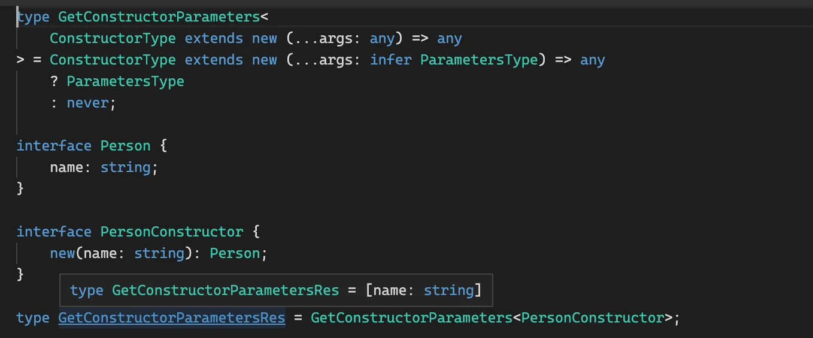

- [TS Playground](https://www.typescriptlang.org/play?#code/C4TwDgpgBA4hwGED2A7AzsATgVwMbCUwAUBDTEgW3gkzQB4AoKZqZdLPAzAFXGggAewCCgAmaKCggB3KAAoAdErIBzNAC4oJFCACUUALwA+LToYmDrVBhz5CvSFEHCxEqbMXLMazQEsUAGY0UKTkVMK0DhD6xqYgTCwA-CFklNSRfAnMmlIAbjQA3AwM-hEBJLjQRDRoqFAA3lmSaZo2-ipFAL7FpTTllSE1qGw2nIQNTe5yKC1QbSgquprVtKhdxaCOcIjWHHbEqeE1AEoQEpbbI3tcoWkR9Cu1KFe2XEZFQA)

::: tip

TS存在 [ConstructorParameters\<Type>](https://www.typescriptlang.org/docs/handbook/utility-types.html#constructorparameterstype) 工具类型。

:::


## 索引类型

索引类型也同样可以用模式匹配提取某个索引的值的类型，这个用的也挺多的，比如 React 的 index.d.ts 里的 `PropsWithRef` 的高级类型，就是通过模式匹配提取了 ref 的值的类型：


我们简化一下那个高级类型，提取 Props 里 ref 的类型：


### GetRefProps

我们同样通过模式匹配的方式提取 ref 的值的类型：

```typescript
type GetRefProps<Props> = 
  'ref' extends keyof Props // Props中是否存在 'ref' 属性
    ? Props extends { ref?: infer Value | undefined } // 对ref的值进行推断
      ? Value
      : never
    : never
```

类型参数 Props 为待处理的类型。

通过 keyof Props 取出 Props 的所有索引构成的联合类型，判断下 ref 是否在其中，也就是 'ref' extends keyof Props。

为什么要做这个判断，上面注释里写了：

```js
// need to check first if `ref` is a valid prop for ts@3.0
// otherwise it will infer `{}` instead of `never`
```

在 ts3.0 里面如果没有对应的索引，Obj[Key] 返回的是 {} 而不是 never，所以这样做下兼容处理。

如果有 ref 这个索引的话，就通过 infer 提取 Value 的类型返回，否则返回 never。

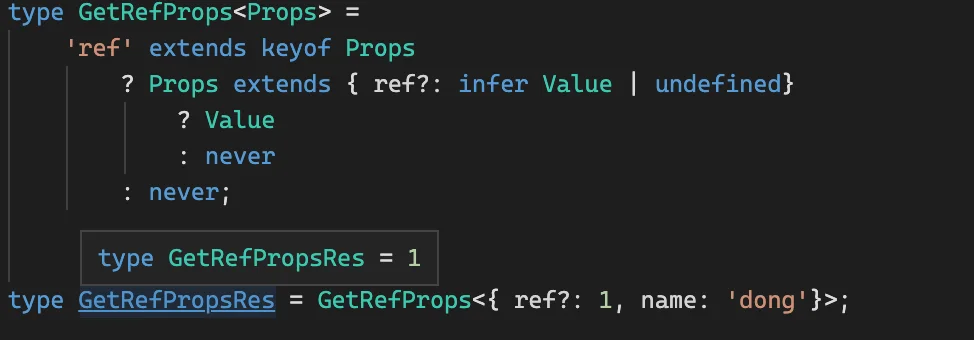

当 ref 为 undefined 时：

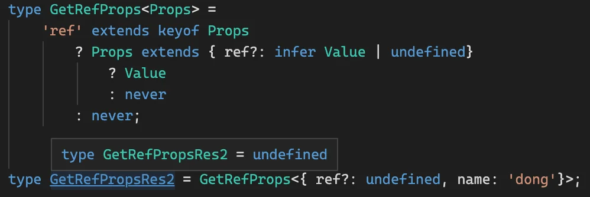


- [TS Playground](https://www.typescriptlang.org/play?ts=4.5.0-beta#code/C4TwDgpgBA4hwCUIDMAKAnA9mAzgHg2xwD4oBeKAKChqgHJ0U6oIAPYCAOwBMcoBrCCEzIohXNVpSA-GKy4W7LrygBvKI2TSAXFACWnZBHRQAagEMANgFdoAHyjWeKAxG4BfSVO9RZFmxBePrS6nBAAbsZBUqERxgDclEmgkLDwSGjyOEg4AEzkaYgo4vjqmjqOzsiu3AA0UJzmALYQunTcmJwA5nTuxImUKdBwRZlEOQUjGSV4ZSgVAIz1jS1tHd29-UlAA)


## 总结

就像字符串可以匹配一个模式串提取子组一样，TypeScript 类型也可以匹配一个模式类型提取某个部分的类型。

**TypeScript 类型的模式匹配是通过类型 `extends` 一个模式类型，把需要提取的部分放到通过 `infer` 声明的局部变量里，后面可以从这个局部变量拿到类型做各种后续处理。** 🎉

模式匹配的套路在数组、字符串、函数、构造器、索引类型、Promise 等类型中都有大量的应用，掌握好这个套路能提升很大一截类型体操水平。

- [TS Playground合集](https://www.typescriptlang.org/play?#code/PTAEm8fRo9UZXlFmTR1TUPexgAOUFj-pCEVoeH1CcyoWUTAtBUAXjQNeUAoMkUABQCcB7AWwEsBnAUwC4yAXATwAO7UAHF2PAGoBDADYBXdgBVB7ADzUAfKAC8NUOwAePdgDsAJqxoMWHVcxMAzdrVDT57LQH5XshaE6gJuwAbs4A3BT8QqLibgoASuyscjI8OjGSvkoq6tZsagDkAOZyUiZFBRoaERRUgA6mgCN+qLVgYjwAYsy0rDy8Khmd3TyqAIK0LobG5pZyJgDWJvQA7iYA2gC6WrpjE0amFqCr9k4ugz0ANKAAdDezC8tr6+ug3mdpAUGhtDVRwm1viWSqXS-y6PVUqwAjOcAEznADMmwivwGYJ4gJSPBhIPEbwhSJaGQAMlIen1om0SeCdvo9tNQHdFisNltQDTJvtLKsbldGQ8Npdjs5QFSeM9vKL-IEQuFIv1KaT0UlMTieKKIdC4YjquS-uJRRjUtjdArwSyalRqPQBDtdTRrTtRuNaVMDnzmZt0uy6QcNi9Ds8At7XVyeUKXICeJd3SZxaBI1LPrK7VaBIa0rpU46obCEQSUan08b7TbxvidYSAMoAC2YDh4tpRNbrDbLwc5DPmTMerPb9L93j9QedHP7McuYccwsjcYTHxl3zl0Wb9fT6RXrdoGtz2uR-Q3RfXtfr2YJlDAgHVtQBk3oAmOWa59AlZ4UloPFYAHVmDxq9wm8-Xx+X7VqoT67CGoA9LQ9hFJcdDsA4zAGC6HaQdBrKgch9IAAYACQAN5wQhBgAL74ah5TEVh-o8LQfgBA4sgcD8+7-m+n7fmuuhPi+bFAaoxSlOUoBlGYoBmPQ5QFJcAllBUOp-jxgEccqRrrqxSnATJQkiWJEkVNJ4mSRWD6JAIMhSAAxlwdqmeZVmgSBNGYQc5EwaA7TWM5liuZcij0F5EE0Wh6SPk5o4HLheHhlY8GIaReEeUw8XRZWcgOERlH+pFhFxfhfnxal6VxVRASgcx0S2ZZ7CcfG7BmVVDkAEQiIJRQlLJBSWAARkkaQOFB+ygGwLyNZcjWeKNoCNQAInphlFI18n9JVVmHroK3sE1UhdRZk3jXts3lPNi01A+ihQYwv79OdzCMKB8TMEU1bDBh4XeUF5ToWFPqWJF0WRvFBSgEDAA+wMADomKDEM8AUmXeDdd00Q9T3DJGWilTR5XCIjKPPTViP3Y9z38e1QmgBTlPAxWKKEzRRLwS933ga5X1gR2kVA9DBSQ9z4Ow8lU4Rr18OgHTtAM-Wqjo1KZVLjjF2S0qQIZmLF2gUr-FUxT82VNjau3Q5r0-YFUGfTo4t48M4ua6BVT67jKmq+LWva-NlN6xQD6AL+KdT3lQbTUC+UiMOIzisHagfB6HxjdKo7SzBZAUJyYFk8MwEmsinSdvaAAAUPIvkUrABNFYzFwAlDoWgxv65eWPOXz60HtAh2H3Q1VHrcx+Hqh5yYbcBD5wlFFwgRyIwPW0FX2haKze7RC3bex6wa0ZEvPdx3nM9zx9RQVgH4iJDwci0CYyhCJHR-iKf585NnyeJ+nmfpA-ucFzcRcl8JJh8BsO9DSFrVE+Z8L7CG8MfW+YDEwLn1pA0BKhDTAhNNfEBd8hB9wHqHIee8AEFF1gfVo4hFC1lYBvduYCyAWXMqwSwh0iigDwmQKmWCx6uRqFTCyElIJyDTvQWg29GHMO1hTb8bArisPSI1Y6EQqbEQoFTas7AZAyHoHnMR396FVyYSIimtAb5n2BkolR9BLgAElwYFEYMDUAABqUAGiJFt1kZTeR8iqHcLSO7XQQQligHodvCI80rjGNUYEigwTQn0CuBZWQMg854QMEkzgkJiIV31m0EhbByGxzAaoRQrJFABXUaQ0uQCsmsDAROT+tBi4BDKH-dYACGn+gqdAgIMYMnENITk5wYDASqgqb02geTfj0AcLpcoITlGqMIaAQAIeaAAIEwAFmr+yITwMxJgehlCspQlEbRNnbNTtkDBABhTxtE+EjP6LnXx+dC61O-g05pv8tDCIproc5WyaK8J4Pw6Btz2B+I-lcL+9Tf4AOioc58xzoHvO1t4aFOyTnCHhVTcFfAaj2FjgxKyNBw4SSESwweptoIRHcdi5wuLhDUAJSYL5PCrlEspr4-uJLXIVwCLS7oElyXywyEi2FiCkiqkFbsnI3LWASQZT8q5cy2gysuX82gwyI77PEIq35-DVWqHhZqq5AKTZ3JBWCn+fAXl8DIKyfVyrDXgWNQ8upgCTg0Gju3SpKgLXwu8Kqyh6LpRN35Qqi5WqVVupXgMlBPAbXavDb3SV0qQ1yotGAQARL6AFR9KAzRD5KgcHQa0Jcr65vzQIVguQC2snhQUfRDgga5zmOwPg4yrAFrRZTH1DBS0BTwqAGtngykuriMIMGswzCxSCGYeRuiEU+HcG2kRjdnDzpgYGotiQ82dtXiKqN66S1lp7X2gI0JAgkvwXpOGNN5TXw3QWwExY2i7s3aoA98F+2djHQhCdlxWEBDPZJYiFYgA)

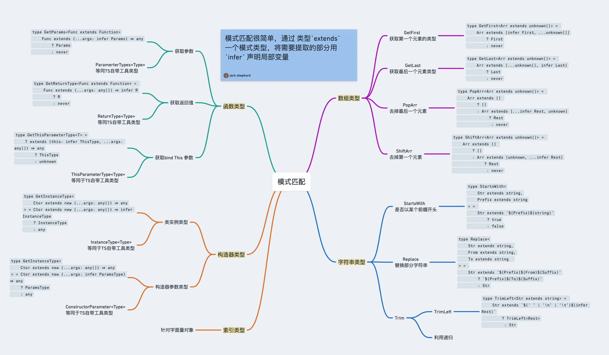


2023年03月07日15:42:29