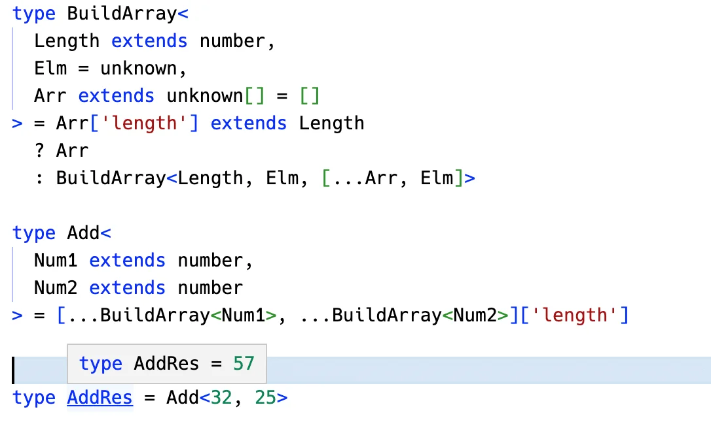
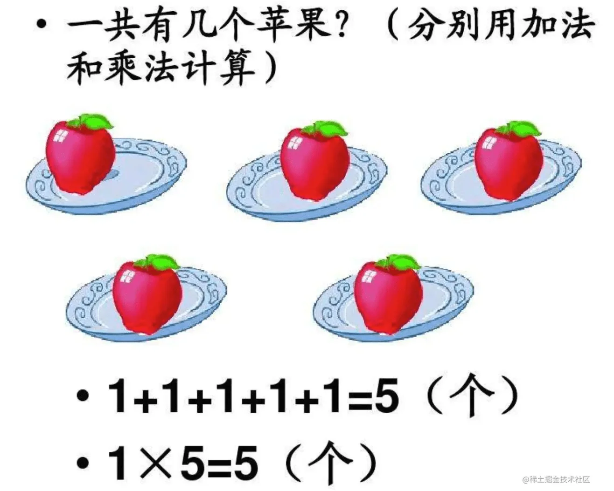
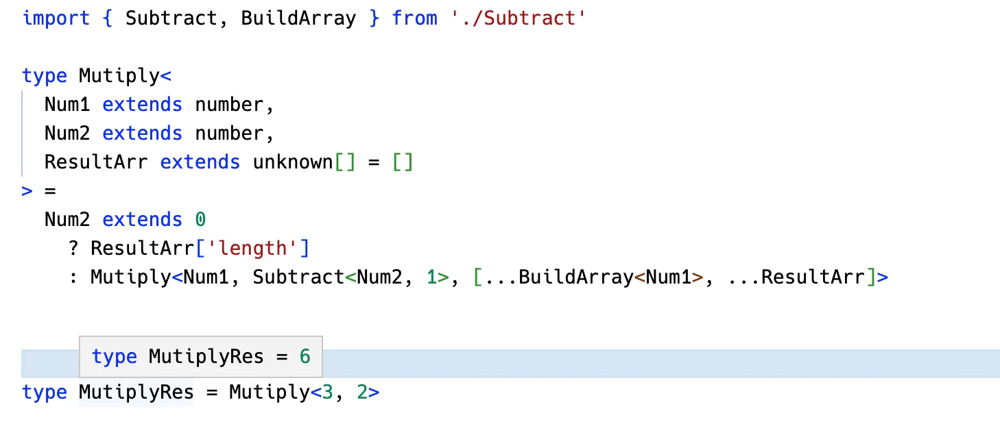
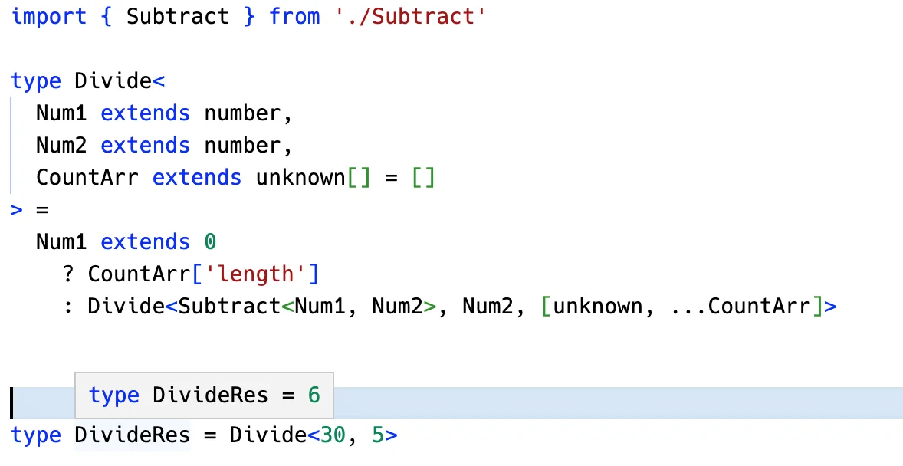
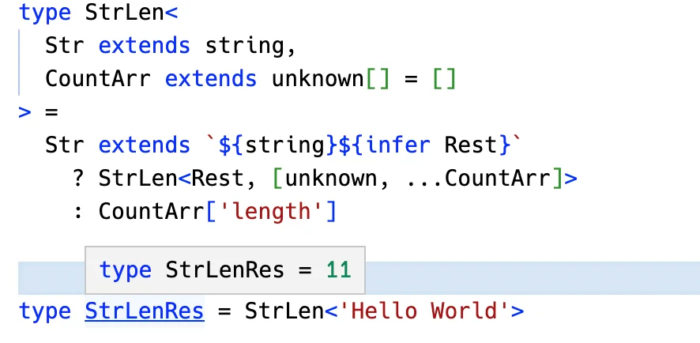
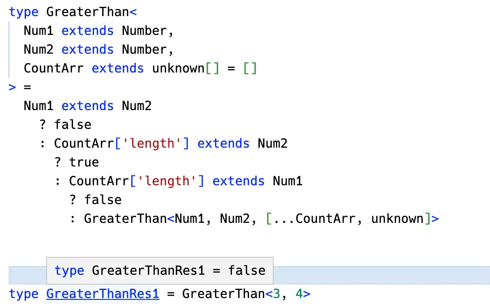
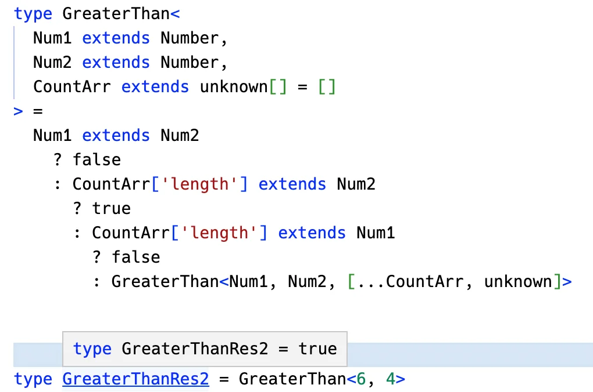
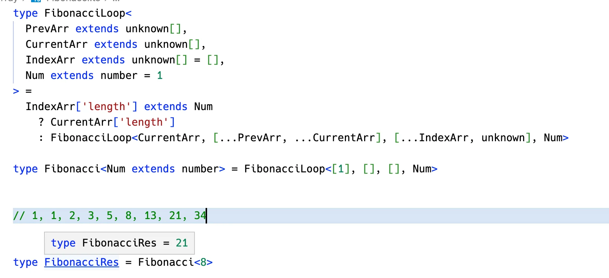

类型系统不是图灵完备，各种逻辑都能写么，但好像没发现数值相关的逻辑。

没错，数值相关的逻辑比较绕，被我单独摘了出来，就是这节要讲的内容。

这是类型体操的第四个套路：**数组长度做计数**。


## 数组长度做计数

TypeScript 类型系统没有加减乘除运算符，怎么做数值运算呢？

📚 不知道大家有没有注意到数组类型取 `length` 就是数值。

比如：


而数组类型我们是能构造出来的，那么通过构造不同长度的数组然后取 `length`，不就是数值的运算么？

**TypeScript 类型系统中没有加减乘除运算符，但是可以通过构造不同的数组然后取 `length` 的方式来完成数值计算，把数值的加减乘除转化为对数组的提取和构造。**

::: info

严格来说构造的是元组，大家知道数组和元组的区别就行

:::

这点可以说是类型体操中最麻烦的一个点，需要思维做一些转换，绕过这个弯来。

下面我们就来做一些真实的案例来掌握它吧。


## 数组长度实现加减乘除

### Add

我们知道了数值计算要转换为对数组类型的操作，那么加法的实现很容易想到：

构造两个数组，然后合并成一个，取 length。

比如 3 + 2，就是构造一个长度为 3 的数组类型，再构造一个长度为 2 的数组类型，然后合并成一个数组，取 length。

构造多长的数组是不确定的，需要递归构造，这个我们实现过 [BuildArray](./7#buildarray) ：

```typescript
type BuildArray<
  Length extends number,
  Elm = unknown,
  Arr extends unknown[] = []
> =
	Arr['length'] extends Length
		? Arr
		? BuildArray<Length, Elm, [...Arr, Elm]>
```

- 类型参数 Length 是要构造的数组的长度。
- 类型参数 Ele 是数组元素，默认为 unknown。
- 类型参数 Arr 为构造出的数组，默认是 []。

- 如果 Arr 的长度到达了 Length，就返回构造出的 Arr，否则继续递归构造。

构造数组实现了，那么基于它就能实现加法：

```typescript
type Add<
  Num1 extends number,
  Num2 extends number,
  Result extends unknown[] = []
> = [...BuildArray<Num1>, ...BuildArray<Num2>]['length']
```

我们拿大一点的数测试下：



结果是对的。

就这样，我们通过构造一定长度的数组取 length 的方式实现了加法运算。


### Substract

加法是构造数组，那减法怎么做呢？

减法是从数值中去掉一部分，很容易想到可以通过数组类型的提取来做。

比如 `3` 是 `[unknown, unknown, unknown]` 的数组类型，提取出 `2` 个元素之后，剩下的数组再取 `length` 就是 1。

所以减法的实现是这样的:

```typescript
type Substract<
  Num1 extends number,
  Num2 extens number
> = 
  BuildArray<Num1> extends [...arr1: BuildArray<Num2>, ...arr2: infer Rest]
  	? Rest['length']
		: never
```

- 类型参数 Num1、Num2 分别是被减数和减数，通过 extends 约束为 number。

- 构造 Num1 长度的数组，通过模式匹配提取出 Num2 长度个元素，剩下的放到 infer 声明的局部变量 Rest 里。

- 取 Rest 的长度返回，就是减法的结果。


就这样，我们通过数组类型的提取实现了减法运算。

有同学可能会问，后面那部分需要 `infer` 提取，所以起个 `arr2` 的名字没问题。前面那部分不需要名字呀，可以去掉 `arr1` 么？

试一下就知道了：


报错显示元组成员或者全部有名字，或者全部没有。

💡PS: 也可以使用都不要参数的形式


### Multiply

我们把加法转换为了数组构造，把减法转换为了数组提取。那乘法怎么做呢？

为了解释乘法，我去翻了下小学教材，找到了这样一张图：



1 乘以 5 就相当于 1 + 1 + 1 + 1 + 1，也就是说乘法就是多个加法结果的累加。

**那么我们在加法的基础上，多加一个参数来传递中间结果的数组，算完之后再取一次 length 就能实现乘法：**

```typescript
type Multiply<
  Num1 extends number,
  Num2 extends number,
  ResultArr extends unknown[] = []
> =
  Num2 extends 0
    ? ResultArr['length']
    : Multiply<Num1, Substract<Num2, 1>, [...BuildArray<Num1>, ...ResultArr]>
```

- 类型参数 Num1 和 Num2 分别是被加数和加数。
- 因为乘法是多个加法结果的累加，我们加了一个类型参数 ResultArr 来保存中间结果，默认值是 []，相当于从 0 开始加。
- **每加一次就把 Num2 减一，直到 Num2 为 0，就代表加完了。**
- 加的过程就是往 ResultArr 数组中放 Num1 个元素。
- 这样递归的进行累加，也就是递归的往 ResultArr 中放元素。
- 最后取 ResultArr 的 length 就是乘法的结果。



就这样，我们通过递归的累加实现了乘法。


### Divide

乘法是递归的累加，那除法不就是递归的累减么？

我再去翻了下小学教材，找到了这样一张图：


我们有 9 个苹果，分给美羊羊 3 个，分给懒羊羊 3 个，分给沸羊羊 3 个，最后剩下 0 个。所以 9 / 3 = 3。

所以，除法的实现就是被减数不断减去减数，直到减为 0，记录减了几次就是结果。

也就是这样的：

```typescript
type Divide<
  Num1 extends number,
  Num2 extends number,
  CountArr extends unknown[] = []
> =
	Num1 extends 0
		? CountArr['length']
		: Divide<Subtract<Num1, Num2>, Num2, [unknown, ...CountArr]>
```

- 类型参数 Num1 和 Num2 分别是被减数和减数。

- 类型参数 CountArr 是用来记录减了几次的累加数组。

- **如果 Num1 减到了 0 ，那么这时候减了几次就是除法结果，也就是 CountArr['length']。**

- 否则继续递归的减，让 Num1 减去 Num2，并且 **CountArr 多加一个元素代表又减了一次**。

这样就实现了除法：



就这样，我们通过递归的累减并记录减了几次实现了除法。

做完了加减乘除，我们再来做一些别的数值计算的类型体操。


## 数组长度实现计数

### StrLen

数组长度可以取 length 来得到，但是字符串类型不能取 length，所以我们来实现一个求字符串长度的高级类型。

字符串长度不确定，明显要用递归。每次取一个并计数，直到取完，就是字符串长度。

```typescript
type StrLen<
  Str extends string,
  CountArr extends unknown[] = []
> =
	Str extends `${string}${infer Rest}`
		? StrLen<Rest, [unknown, ...CountArr]>
		: CountArr['length']
```

- 类型参数 Str 是待处理的字符串
- 类型参数 CountArr 是做计数的数组，默认值 [] 代表从 0 开始。

- **每次通过模式匹配提取去掉一个字符之后的剩余字符串，并且往计数数组里多放入一个元素。递归进行取字符和计数**。

- 如果模式匹配不满足，代表计数结束，返回计数数组的长度 `CountArr['length']`。

这样就能求出字符串长度：




### GreaterThan

能够做计数了，那也就能做两个数值的比较。

我们往一个数组类型中不断放入元素取长度，如果先到了 A，那就是 B 大，否则是 A 大：

```typescript
type GreaterThan<
  Num1 extends number,
  Num2 extends number,
  CountArr extends unknonw[] = []
> =
  Num1 extends Num2
    ? false
    : CountArr['length'] extends Num2
      ? true
      : CountArr['length'] extends Num1
        ? false
        : GreaterThan<Num1, Num2, [...CounterArr, unknown]>
```

- 类型参数 Num1 和 Num2 是待比较的两个数。

- 类型参数 CountArr 是计数用的，会不断累加，默认值是 [] 代表从 0 开始。

- 如果 Num1 extends Num2 成立，代表相等，直接返回 false。

- **否则判断计数数组的长度，如果先到了 Num2，那么就是 Num1 大**，返回 true。

- 反之，如果先到了 Num1，那么就是 Num2 大，返回 false。

- 如果都没到就往计数数组 CountArr 中放入一个元素，继续递归。

这样就实现了数值比较。

1️⃣ 当 3 和 4 比较时：




2️⃣ 当 6 和 4 比较时：




### Fibonacci

谈到了数值运算，就不得不提起经典的 Fibonacci 数列的计算。

Fibonacci 数列是 `1、1、2、3、5、8、13、21、34、……` 这样的数列，有当前的数是前两个数的和的规律。

```bash
*F*(0) = 1，*F*(1) = 1, *F*(n) = *F*(n - 1) + *F*(n - 2)（*n* ≥ 2，*n* ∈ N*）
```

也就是递归的加法，在 TypeScript 类型编程里用构造数组来实现这种加法：

```typescript
type FibonacciLoop<
    PrevArr extends unknown[], 
    CurrentArr extends unknown[], 
    IndexArr extends unknown[] = [], 
    Num extends number = 1
> = IndexArr['length'] extends Num
    ? CurrentArr['length']
    : FibonacciLoop<CurrentArr, [...PrevArr, ...CurrentArr], [...IndexArr, unknown], Num> 

type Fibonacci<Num extends number> = FibonacciLoop<[1], [], [], Num>;
```

- 类型参数 PrevArr 是代表之前的累加值的数组。类型参数 CurrentArr 是代表当前数值的数组。

- 类型参数 IndexArr 用于记录 index，每次递归加一，默认值是 []，代表从 0 开始。

- 类型参数 Num 代表求数列的第几个数。

- 判断当前 index 也就是 IndexArr['length'] 是否到了 Num，到了就返回当前的数值 CurrentArr['length']。

- 否则求出当前 index 对应的数值，用之前的数加上当前的数 [...PrevArr, ... CurrentArr]。

- 然后继续递归，index + 1，也就是 [...IndexArr, unknown]。

- 这就是递归计算 Fibinacci 数列的数的过程。

可以正确的算出第 8 个数是 21:




## 总结

TypeScript 类型系统没有加减乘除运算符，所以我们**通过数组类型的构造和提取，然后取长度（`length`）的方式来实现数值运算**。

我们通过构造和提取数组类型实现了加减乘除，也实现了各种计数逻辑。

用数组长度做计数这一点是 TypeScript 类型体操中最麻烦的一个点，也是最容易让新手困惑的一个点。


- [TS Playground汇总](https://www.typescriptlang.org/play?#code/PTAEEEBNIKAFwJ4AcCmoBCBXAlgG0uAE6ECGCAPDKNaADIoB2A5nABagoAecjkAzqAaYAtgCMUhADSgqNAKK40AXlCYGAawYB7AO4Nps6kUIduvAWs26GAbQC6oFfZgA+RxGI2A5IuZsvDlw8DPx0jCzshjTUAPweJlHRAFwYOPjGZOT0fqzSCijSNgB0JcZ5inYuANwwtYioENDkAHIiAIymwaFCYhLSrcIATJ3mgiLihG4qUcUlWHgExJkDbS6SJUXz6UsUA4Mudt6+EQE1dchoUJAASih8mLhw7lfkAMyD0oMArNW1MCCgADKmFEcFIAGM4PALkCQWCSJCWu0RiEBD0Jv0RMMgqN0RIpjJoltFqRdu03DjUaBZkUSMQ2iliRkyUM1qANnTCIMUtgGAAzCSgW58OB2RI0OLCuBHcL+MXRZKCFAANwkZ3qaGBoIhcGFDyeKi18MRr1e0ja+zOAIAsvrsEhcAhoQ1bXB7Y6kcIOpTuuM+qA9ijfb0pEK7vqgxYNNo9PZ3PYplFAz6BAAGUCS8OPGU5ALi6gpV3ulltaRGnWej6gVaFDZMnaemvskp6x6VdUwosOhCtg2gLses2gQYj37-MAAEWwyuwkBQzrQU5nc8bkbGIcxQzXeNDAGEtGo4MY15YY7YHE5Ko4k8iU6B03F94fjDmTvKFQXQEvZyhyOWEXAjabvswGFKe1jSBsT4MEexDtucDTfnOvbuEhv6vKm0g-Gc45AmC2QLnhhDZJQ0SAmCa4ioQvJMJIUTQbBJh3uBsYXtSYoEuRTFmFSAAGAAkADeVE0QAvkJvICiYUqibxGZESRUq1iUDFlKo0bWFeKSqZ4PiyqweaEVx2QoYa+GMOQXgABIoLguBaKAADqWiEPgXhjrhADihAoCQPCEAAKqwJAMIR3m+f5QUhaRNArNufpSDeW53judHRDp3FdFGVisfGHHuHFd6BlEcR8iQuB8POioZa+cprns+byWCmBVR+oDaQeMEvnpuaBDxoQrI10SleVlVDTQKThX5EhRQwQEBliylFBl0gsQw8EIWgU2RcFDCmaA20zbtbzSAALGOGoHT502BbtvbDCoh23dFABsZ1jgCABi2CiFoDAIuC2CEd9v3-eCgO0FoWhIDF1AAAo+cqx7MRprEGOlmDEIwjEnqj57ozQACSIRcMj-XZWecaXgT1ADPFIbuG0rjuMTc6cN1xx1UVIglaAu6Yz5XW6ZzBnvp+IN-QD2CQ9D5D81jQuhjSCMqmpUEC9jxh2EtrOk8Qq149rC3CG4m2gBLYOA569MTASFtSzLMM2G0Rv2IURsDB5AJtIAgAy+4MPuvD7Xw+wAHH7QeDL7ryncDP2S+D2D7fbifkKH1RAA)


2023年03月10日15:36:14

