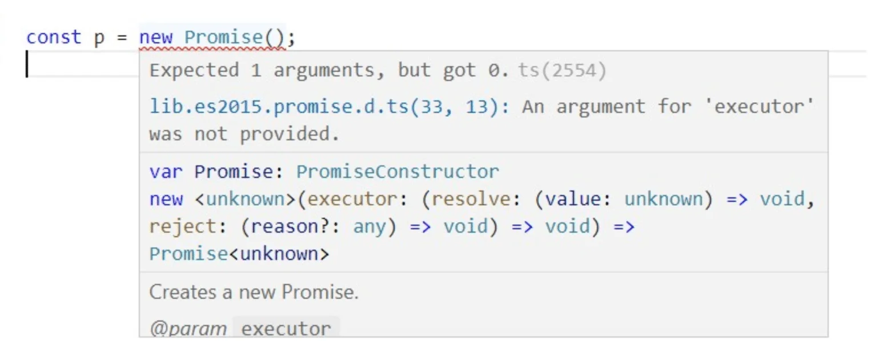
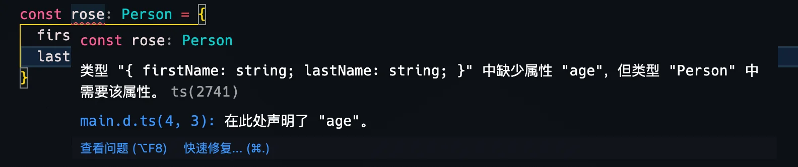

原文链接：

- [TypeScirpt类型声明完全指南 - @pengfeixc](https://www.pengfeixc.com/blogs/javascript/typescript-declarations)

::: tip

搬运这边文章，确实因为它解决了我对类型声明文件的一些疑惑：

- 如何定义 `.d.ts` 文件
- 如何使用 `compilerOptions#typeRoots` 引入自定义types，以及第三方 `node_modules/@types/**`
- 如何使用三斜线指令引入类型，以及引入 `<reference />` 后的类型共享
- 环境声明（`ambient declarations`）& 环境值 （`ambient values`）是什么？只允许定义，不允许实现或者值的存在
- 如何在声明文件中使用 `namespace` 解决可能存在的命名冲突, namespace本质上是一个对象字面量，但是声明文件中是不允许存在对象的，因此需要写成 `declare namespce XXX {}` 形式，将其变为一个环境值😎
- 模块系统（使用`export {}` 等方式）对全局环境类型的影响🔥，如何使用 `declare global {}` 引入全局类型解决这一问题

:::


**类型声明（Type Declaration）** 或者 **类型定义（Type Definition）** 文件是一个以`.d.ts`作为文件后缀名的TypeScript文件。它们与普通`.ts`文件有什么区别呢？有什么特征呢？接下来，一起深入了解下。


## 一.`.d.ts`文件

类型声明文件的后缀名为`.d.ts`，文件中只包含与类型相关的代码，不包含逻辑代码，它们的作用旨在为开发者提供类型信息，所以它们只在开发阶段起作用🎉。

::: tip

📚 typescript编译后会将类型信息移除，类型信息仅在开发阶段起作用。

:::

类型声明，即类型的声明，例如`interface`、`function`和`class`，下面是一个`interface`声明。

```typescript
// Person接口类型声明
interface Person {
  name: string;
  age: number;
}

// 使用Person接口
const xm: Person = {
  name: 'XiaoMing',
  age: 8
}
```


## 二.全局声明

**全局声明（global declaration）**  在任何TypeScript项目或者TypeScript代码片段中都会起作用的。例如当你写下`const p = new Promise();`时，TypeScript编译器不会去编译你的代码，因为`const p = new Promise();`语法错误了，如果你使用的是vscode IDE，那么vscode向下图中那样提示你。



vscode就是根据全局声明检测到你的语法错误的。每个TypeScript程序都可以使用全局声明，无需显示的用`import`语句导入。

从IDE的提示中，可以看到`Promise`类型是定义在`lib.es2015.promise.d.ts`文件中的，由TypeScript提供，TypeScript提供的很多这样的声明文件，被称作**标准库📚**（这些声明文件会随TypeScript一起安装）。

::: tip

使用`lib`编译选项，你可以控制哪些标准库被引入到当前项目。也可以设置`noLib`为`true`，这样会在项目中禁用所有标准库。

:::

为了手动的去加载一些全局声明文件，我们需要告诉TypeScript编译器声明文件的位置。可以通过`typeRoots`和`types`编译选项设置，关于这些内容，我也在[tsconfig overview](./tsconfig-overview)里面讲解过。

接下来，动手实践。创建以下文件结构:

```bash
.
├── program.ts
├── tsconfig.json
└── types
    └── common
        ├── main.d.ts
        └── package.json
```

在我们的项目中，我们需要一些公共类型，在每个ts文件中都可以使用这些公共类型，所以我打算在`project/types/common/main.d.ts`中存放这些公共类型声明，使用`typeRoots`告诉TypeScript声明文件的位置。TypeScript编译器会根据[**Node模块定位策略**](https://pengfeixc.com/blogs/javascript/typescript-module-system)导入`typeRoots`指定的目录下的声明文件，如果没有提供`typeRoots`选项，默认会导入`node_modules/@types`文件夹中的声明文件。

`node_modules/@types`是`typeRoots`的默认值，`node_modules/@types`的目的仅仅是为了提供公共包的类型声明，目录下的每个声明模块的根目录下都应该包含一个`index.d.ts`文件，用来作为typescirpt入口声明文件，如果没有`index.d.ts`文件，它应该有一个`package.json`文件，`package.json`文件需要指出入口声明文件的位置。

现在我需要把`project/types/common/main.d.ts`文件，作为入口声明文件，所以在`project/types/common/package.json`文件中需要添加以下内容。

::: code-group

``` json [types/common/package.json]
{
    "name": "common",
    "version": "1.0.0",
    // "typings" 或者 "types" 都可以
    "typings": "main.d.ts"
}
```

:::

`typings`用于指示入口声明文件的位置。

接下来，配置`typeRoots`，告诉TypeScript自定义全局声明的位置，修改`tsconfig.json`文件内容如下。

::: code-group

``` json [tsconfig.json]
{
    "files": [
        "./program.ts"
    ],
    "compilerOptions": {
        "typeRoots": [
            "./types"
        ]
    }
}
```

:::


在`main.d.ts`文件中添加声明信息。


::: code-group

``` typescript [types/common/main.d.ts]
interface Person {
    firstName: string;
    lastName: string;
    age: number;
}
```

:::

有了声明信息，可以在`program.ts`中使用该类型了。



正如图片中显示的那样，定义了`Person`类型的`ross`变量，因为赋值与类型不兼容，所以IDE报错，IDE还给出了声明文件的位置。修改program.ts文件如下，修复错误。

```typescript
const ross: Person = {
    firstName: "Ross",
    lastName: "Geller",
    age: 20
};
```


## 三.声明模块化

在上面的例子中，TypeScript仅仅知道`main.d.ts`声明文件，假如项目中包含几千个声明信息，将这些声明全部放到`main.d.ts`文件中，会使项目变得非常糟糕，不好维护。因此，需要将声明模块化。

在[命名空间](./namespace-in-typescript)教程中，我介绍过可以使用 [\<reference />](../reference/triple-slashes-directives)指令，在编译阶段添加一些文件。当然我们也可以在声明文件中使用该指令。首先`project/types/common/`文件夹下添加`functions.d.ts`和`interfaces.d.ts`文件。

`interfaces.d.ts`提供`common`包中所有的接口类型信息，`functions.d.ts`提供`common`包中所有的函数类型信息。并在`main.d.ts`文件中，使用`<reference />`指令引入它们。

::: code-group

``` typescript [types/common/main.d.ts]
/// <reference path="./interfaces.d.ts" />
/// <reference path="./functions.d.ts" />
```

``` typescript [types/common/interfaces.d.ts]
interface Person {
    firstName: string;
    lastName: string;
    age: number;
}
```

``` typescript [types/common/functions.d.ts]
type GetFullName = ( p: Person ) => string;
```

:::

有一点值得注意的是，我们可以在`functions.d.ts`文件中，使用`interfaces.d.ts`文件中定义的`Person`接口，这是因为使用`<reference />`指定，指定的文件可以共享类型声明😎。

修改`program.ts`文件使用定义的类型。

::: code-group

``` typescript [program.ts]
const ross: Person = {
    firstName: "Ross",
    lastName: "Geller",
    age: 20
};

const getPersonName: GetFullName = (p: Person) => {
    return `${p.firstName} ${p.lastName}`;
};

console.log(getPersonName(ross));
```

:::


## 四.第三方声明

目前，已经知道了如何创建自定义全局声明文件。某些情况下，我们需要安装第三方提供的npm声明文件包。

在[Compilation](./tsconfig-overview)文章中我提到过[DefinitelyTyped](https://github.com/DefinitelyTyped/DefinitelyTyped)社区，它们为我们提供了很多第三方npm声明文件包，例如`@types/lodash`和`@types/node`等等。你可以使用npm安装[`@types`](https://www.npmjs.com/org/types)下的声明包。

```bash
npm install -D @types/node
```

这些包会被下载到`node_modules/@types`文件夹下，这也是为什么`typeRoots`的默认值为`node_modules/@types`。如果你想在默认值的基础上额外添加一个声明文件夹目录，需要给`typeRoots`指定两个值。

::: code-group

``` json [tsconfig.json]
{
    "files": [
        "./program.ts"
    ],
    "compilerOptions": {
        "typeRoots": [
            "./node_modules/@types", // [!code ++]
            "./types"
        ]
    }
}

```

:::


## 五.环境相关的声明

某些值，只存在于运行时。例如[`window`](https://developer.mozilla.org/en-US/docs/Web/API/Window)对象，它只存在于浏览器环境中，同样的还有node中的[`global`](https://nodejs.org/api/globals.html#globals_global)。

如果当你在TypeScript程序中，使用`window`或者`glbal`时，typescirpt编译器报错了`cannot find name 'window'`。这是正常的，因为没有定义`window`变量。所以，如果没有定义，我们如何使用`window`对象呢？

我们需要使用`declare`关键字告诉TypeScript编译器，`window`变量存在，不要再报错了。

```typescript
declare var window: any;
```

这句代码，被称为**环境声明（ambient declaration）**，其中`window`被称为**环境值（ambient value）**。有了这个声明，TypeScript会认为这个`any`类型的`window`变量已经定义了，所以在任何地方使用`window`变量都不会报错了。

你也可以为环境值提供指定的类型，例如`declare var window: Person;`

接下来，在`main.d.ts`文件中添加一个环境值`XiaoMing`。

::: code-group

``` typescript [types/common/main.d.ts]
/// <reference path="functions.d.ts" />
/// <reference path="interfaces.d.ts" />

// 只有定义 没有实现，称之为 环境声明（ambient declaration）
// XiaoMing 则表示是环境值（ambient value）
declare var XiaoMing: Person // [!code ++]
```

:::

然后在`program.ts`中使用它。

```typescript
console.log(XiaoMing.age);
```

如果没有写错的话，TypeScript不会报错。


## 六.命名空间的声明

在前面的例子中，我们提供了`types/common`声明包，定义了全局`Person`接口类型，全局的接口类型有一个弊端，就是很容易被其他包里的声明文件类型覆盖（类型冲突）。

为了避免这个问题，最好的解决方式是将类型定义在命名空间里。在[namespace](./namespace-in-typescript)文章中，介绍了namespace的用法，我们可以在命名空间里定义类型声明。

修改声明文件内容如下。

::: code-group

``` typescript [types/common/interfaces.d.ts]
// 使用namespcae
declare namespace common { // [!code ++]
    interface Person {
        firstName: string;
        lastName: string;
        age: number;
    }
}
```

``` typescript [types/common/functions.d.ts]
declare namespace common { // [!code ++]
    type GetFullName = ( p: Person ) => string;
}
```

```typescript [types/common/main.d.ts]
/// <reference path="./interfaces.d.ts" />
/// <reference path="./functions.d.ts" />
```

:::

这里定义的命名空间类型与[namespace](https://pengfeixc.com/blogs/javascript/typescript-namespace)文章中有点不一样，区别在于使用了declare关键字。因为`namespace`是一个值（object），在声明文件`.d.ts`文件中应该将`namespace`定义成**环境值**，这样我们可以在任何`ts`文件中，通过`common`命名空间使用`common.<type>`类型，例如`common.Person`。

::: warning

🚨再次提醒，在声明文件中只允许包含声明信息，因为命名空间是一个object，所以不能在声明文件中定义它，但是我们可以将命名空间定义成环境值。

:::

并且，当命名空间被定义在声明文件中，`export`关键字就不需要了，命名空间内部的所有类型，都被隐式export。另外，你不能从命名空间中导出一个值，只允许导出类型。


## 七.类型扩展

当typescript预见多个同名接口类型，它会自动合并这些接口类型成为一个声明。

namespace也有类似的行为，当声明一个已经存在的命名空间时，typescript会自动扩展已经存在的命名空间。所以当接口和命名空间在全局环境中，可以重新声明它们来达到扩展它们的目的。

更新声明文件。


::: code-group

``` typescript [types/common/interfaces.d.ts]
// Person 不使用 namespcae
interface Person {
    firstName: string;
    lastName: string;
    age: number;
}
```

``` typescript [types/common/functions.d.ts]
declare namespace common { // [!code ++]
    type GetFullName = ( p: Person ) => string;
}
```

```typescript [types/common/main.d.ts]
/// <reference path="./interfaces.d.ts" />
/// <reference path="./functions.d.ts" />
```

:::

更新`program.ts`。


::: code-group

``` typescript [program.ts] {1,6,18}
// 与types/common/interfaces.d.ts中的Person interface合并
interface Person {
    email: string;
}

// 扩展原生的Number类型
interface Number {
  // https://stackoverflow.com/a/44481256/7185283
  isEven: () => boolean;
}

const ross: Person = {
    firstName: "Ross",
    lastName: "Geller",
    age: 29,
    email: "ross@geller.com"
};
// https://stackoverflow.com/a/32330345/7185283
Number.prototype.isEven = function(this: number): boolean {
  return this % 2 === 0
}
const isAgeEven = ross.age.isEven();

console.log("isAgeEven", isAgeEven);

```

:::

此时typescript并不会报错。在`program.ts`中扩展了`Person`接口和`Number`（内置类型）接口。

但是，这并不适用于**模块系统(CJS | ESM等)**，值和类型只能在**script**文件中共享，**script**文件就是不包含`import`和`export`语句的文件。

可以在`program.ts`文件最后面添加一行代码`export {}`。

::: code-group

``` typescript [program.ts]
// 与types/common/interfaces.d.ts中的Person interface合并
interface Person {
    email: string;
}

// 扩展原生的Number类型
interface Number {
  // https://stackoverflow.com/a/44481256/7185283
  isEven: () => boolean;
}

const ross: Person = {
    firstName: "Ross",
    lastName: "Geller",
    age: 29,
    email: "ross@geller.com"
};
// https://stackoverflow.com/a/32330345/7185283
Number.prototype.isEven = function(this: number): boolean {
  return this % 2 === 0
}
const isAgeEven = ross.age.isEven();

console.log("isAgeEven", isAgeEven);

// 🚀引入下面语句，将 program.ts文件变为了一个模块，而不是全局的script
export {} // [!code ++]
```

:::


此时typescript应该会给出以下错误信息。

```bash
Type '{ firstName: string; lastName: string; age: number; email: string; }' is not assignable to type 'Person'.
Object literal may only specify known properties, and 'firstName' does not exist in type 'Person'.ts(2322)

Property 'age' does not exist on type 'Person'.ts(2339)
```

因为，添加`export {}`代码，将`program.ts`文件转换成了模块（module），这种情况下，typescript不会扩展全局环境中的类型，而是在当前模块内重新声明该类型。

那么如何在模块中，扩展全局环境中的类型呢？TypeScript提供了`declare global`环境声明语句，使用它，可以在模块内给全局作用域添加声明。

更新`program.ts`，使用`declare global`语句。

::: code-group

``` typescript [program.ts]
declare global { // [!code ++]
  interface Person {
    email: string;
  }
}

declare global { // [!code ++]
  interface Number {
    // https://stackoverflow.com/a/44481256/7185283
    isEven: () => boolean;
  }

  var Version: string
}

const rose: Person = {
  first: 'rose',
  last: 'durant',
  age: 36,
  email: 'rose@example.com'
}

const getFullname: common.GetFullname = (p: Person) => {
  return p.first + ' ' + p.last
}

// var version = 20

console.log(getFullname(rose))

// https://stackoverflow.com/a/32330345/7185283
Number.prototype.isEven = function(this: number): boolean {
  return this % 2 === 0
}
console.log(rose.age.isEven())


// console.log(XiaoMing.age)

// var version: Version = '1.0.0'
const Version = '1.0.0'
console.log(Version)

export {}
```

:::

这次typescript不会报错，并且成功在module内扩展了全局类型😎。


2023年02月26日00:18:37

