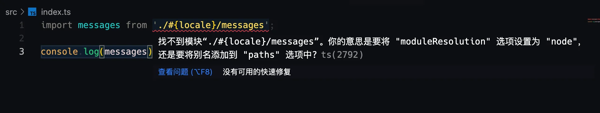

对于tsconfig.json中的 [compilerOptions#rootDirs](https://www.typescriptlang.org/docs/handbook/module-resolution.html#virtual-directories-with-rootdirs) 配置项的思考来自于 `Module Resolution` 这一节。


::: info 中文文档

- [Module Resolution 腾讯开发者文档](https://cloud.tencent.com/developer/section/1476115)

:::

一开始实在是不太理解这一个字段的含义是什么，后面根据思考后得出：`这个字段允许将多个目录文件假设存放在同一个目录下,通过配置 rootDirs，编译器可以解析并不存在的相对模块导入`，可以参考文档中国际化的示例，项目结构为：

```bash
.
├── src
│   ├── de
│   │   └── messages.ts
│   ├── index.ts
│   └── zh
│       └── messages.ts
└── tsconfig.json
```

::: tip

上面树形结构，使用下面命令：

```bash
# -I 'dir1|dir2' 忽略目录
# -L 3 打印层级
tree -I 'node_modules|output|dist' -L 3
```

:::


文件配置为：

::: code-group

``` typescript [src/index.ts] {1}
import messages from './#{locale}/messages';

console.log(messages)
```

``` typescript [src/zh/messages.ts]
export default ["hello", "nice to meet you"];
```

``` typescript [src/zh/messages.ts]
export default ["您好吗", "很高兴认识你"];
```

:::

其中 `./#{locale/messages}` 并不存在，不设置 `tsconfig.json#rootDirs` 配置：

::: code-group

``` json [tsconfig.json] {8}
{
  "compilerOptions": {
    "target": "es2016",
   
    /* Modules */
    "module": "esnext",
    /* Allow multiple folders to be treated as one when resolving modules. */
    // "rootDirs": [],

    /* Interop Constraints */
    "esModuleInterop": true,                         
  
    /* Type Checking */
    "strict": true,                                
    "skipLibCheck": true
  },
  "exclude": ["rollup.config.js"]
}

```

:::

出现报错： `找不到模块 "./#{locale}/messages"`



这也很好理解，因为根本就不存在 `"./#{locale}/messages"` 模块，但是，如果我们进行如下设置：

```json
{
  "compilerOptions": {
    "target": "es2016",
   
    /* Modules */
    "module": "esnext",
    /* Allow multiple folders to be treated as one when resolving modules. */
    // "rootDirs": [], // [!code --]
    "rootDirs": ["src/zh", "src/de", "src/#{locale}"], // [!code ++]

    /* Interop Constraints */
    "esModuleInterop": true,                         
  
    /* Type Checking */
    "strict": true,                                
    "skipLibCheck": true
  },
  "exclude": ["rollup.config.js"]
}
```

此时TypeScript不再报错🎉，这是因为，**编译时，导入的相对路径会被转换为绝对路径，即项目 `/ts-demo/src/#{locale}/messages`, 接着遍历 `rootDirs` 列表， 找出于这个路径相比最长的前缀匹配路径，最终确定的是 `/ts-demo/src/#{locale}/`。将 `/ts-demo/src/#{locale}/messages` 与 `/ts-demo/src/#{locale}/` 相同的部分去掉，确定要加载的位置是 `messages`**。候选位置为 `/ts-demo/src/${locale}/messages`，编译器将会按照相对路径模块导入的解析方法进行模块解析，不过 `/ts-demo/src/${locale}/` 目录并不存在，于是编译器会从 `rootDirs` 列表从上到下进行遍历（除去之前选定的那个目录），然后将 **messages** 与路径进行拼接，新的尝试的路径为 `/ts-demo/src/zh/`，模块候选位置为 `/ts-demo/src/zh/messages`，在此处找到了模块，因此将 `/ts-demo/src/zh/messages.ts` 作为模块解析结果。

::: warning

`rootDirs` 对编译输出并没有影响，只是让编译器知道模块的含义。

使用 `tsc` 进行打包，得到的 `index.js` 为：

```js
import messages from './#{locale}/messages';
console.log(messages);

```

:::

参考：

- [https://www.zhuscat.com/posts/typescript-rootdirs/](https://www.zhuscat.com/posts/typescript-rootdirs/)


为了验证上面的说法，使用 `rollup` 对项目进行打包：

```bash
pnpm i -D rollup @rollup/plugin-typescript
```

::: code-group

``` js [rollup.config.js]
import { defineConfig } from 'rollup'
import typescript from '@rollup/plugin-typescript'

export default {
  input: 'src/index.ts',
  output: {
    dir: 'output',
    format: 'cjs'
  },
  plugins: [
    typescript(),
  ]
}
```

:::

然后执行：

```bash
npx rollup -c
```

打包得到：

::: code-group

``` js [output/index.js]
'use strict';

var messages = ["您好吗", "很高兴认识你"];

console.log(messages);
```

:::

可以看出 `/ts-demo/src/zh/messages.ts` 作为了模块解析的结果。


可以通过调整 `rootDirs` 的顺序，对生成的结果进行调整：

```json
{
  "compilerOptions": {
    "target": "es2016",
   
    /* Modules */
    "module": "esnext",
    /* Allow multiple folders to be treated as one when resolving modules. */
    "rootDirs": ["src/zh", "src/de", "src/#{locale}"], // [!code --]
    "rootDirs": ["src/de", "src/zh", "src/#{locale}"], // [!code ++]

    /* Interop Constraints */
    "esModuleInterop": true,                         
  
    /* Type Checking */
    "strict": true,                                
    "skipLibCheck": true
  },
  "exclude": ["rollup.config.js"]
}
```

再使用 `npx rollup -c` 打包，得到的结果为：

::: code-group

``` js [output/index.js]
'use strict';

var messages = ["hello", "nice to meet you"];

console.log(messages);
```

:::

2023年02月24日20:55:00

