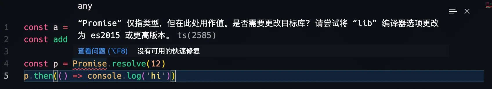
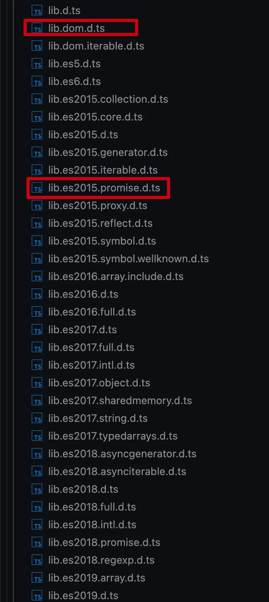

[target](../tsconfig/compiler/lang-and-env.html#target-👍🚀🚀): 表示通过 `tsc` 编译生成指定语法特性的js产物，可选值为 `es3 | es5 | es2015` 等等，这个值会影响 [lib](../tsconfig/compiler/lang-and-env.html#lib-👍🚀) 的默认值。

1️⃣ 比如将 `target` 设置为 `es5`：

::: code-group

``` json [tsconfig.json]
{
  "compilerOptions": {
    "target": "es5"
  }
}
```

:::

此时 `lib` 的默认值为：

```json
{
  "lib": ["dom", "es5", "ScriptHost"]
}
```

2️⃣ 如果将 `target` 设置为 `es2015`：

::: code-group

``` json [tsconfig.json]
{
  "compilerOptions": {
    "target": "es5" // [!code --]
    "target": "es2015" // [!code ++]
  }
}
```

:::

此时 `lib` 的默认值将变为：

```json
{
  "lib": ["dom", "es5", "ScriptHost"] // [!code --]
  "lib": ["dom", "es2015", "ScriptHost", "DOM.Iterable"] // [!code ++]
}
```

一般我们只需要设置`target`即可，`lib` 使用对应的默认值即可。但是有时我们需要同时设置这2个配置项🤔。

在介绍这种情况之前，我们先了解一下 `target` 配置项的效果。

👩‍🏫 `target` 会对TypeScript中的高级法语降级为指定版本的语法，比如指定 `target: 'es5'`，而使用到了箭头函数，和 `const` 关键词。

::: code-group

``` typescript [index.ts]
const a = 12
const add = (a: number, b: number) => a + b
```

``` json [tsconfig.json]
{
  "compilerOptions": {
    "target": "es5"
  }
}
```

:::

对ts文件编译：

```bash
npx tsc --noEmitOnError
```

生成的js文件为：

```js
"use strict";

var a = 12;
var add = function (a, b) { return a + b; };
```

可以看出tsc对源文件进行了语法降级。

我们知道 `Promise` 是 `ES2015` 特性，但是tsc并不能对该构造进行语言降级，只能通过外部引入 `polyfills` 的方式😅😅。

如果我们在源文件中添加Promise:

::: code-group

``` typescript [index.ts]
const a = 12
const add = (a: number, b: number) => a + b

const p = Promise.resolve(12)  // [!code ++]
p.then(() => console.log('hi')) // [!code ++]
```

:::


::: warning

因为vscode默认会导入自己内置的typescript `lib` ，这会导致上面的代码在编辑器中并不会报错，为了演示，可以通过 `typeRoots` 将默认导入的lib暂时关闭：

```json
{
  "compilerOptions": {
    "target": "es5",
    "typeRoots": [] // [!code ++]
  }
}
```

:::

关闭默认lib后，此时vscode并会提示我们：`“Promise” 仅指类型，但在此处用作值。是否需要更改目标库? 请尝试将 “lib” 编译器选项更改为 es2015 或更高版本。`



::: tip

我们知道typescript除了转义TS -> JS外，还提供了type check的功能。上面的报错便是type check的功能了。

🚀🚀 另外我们还需要知道，`TS永远也不会注入polyfills，这不是TypeScript得职责`。

:::

如果我们想要生成的代码是 `ES5`，但是却引用了 `ES2015` 的一些特性，为了告诉TypeScript，我们自己会处理好语法polyfills，我们可以去设置 `lib` 这个属性，告诉TS类型检测功能，这里使用 `Promise` 是OK的，不需要报错。

::: code-group

``` json [tsconfig.json]
{
  "compilerOptions": {
    "target": "es5",
    "lib": ["DOM", "ES5", "ES2015.Promise"] // [!code ++]
    "typeRoots": []
  }
}
```

:::

设置好后，TS检测到 `Promise` 语法便不再提示错误了😎。

此时编译产物为：(`Promise` 的polyfill需要我们自己额外添加进去)

```js
"use strict";

var a = 12;
var add = function (a, b) { return a + b; };
var p = Promise.resolve(12);
p.then(function () { return console.log('hi'); });
```


而 `lib` 中的类型，都可以在 `node_modules/typescript/lib/*` 中找到：




PS：除了上面的方式外，如果我们的 `target` 为 `es2015` 或者以上版本，则就不需要设置 `lib` 了，因为此时lib默认是包含 `es2015` 所有语法特性和构造的。比如：

::: code-group

``` json [tsconfig.json]
{
  "compilerOptions": {
    "target": "es5", // [!code --]
    "target": "es2015", // [!code ++]
    "lib": ["DOM", "ES5", "ES2015.Promise"] // [!code --]
    "typeRoots": []
  }
}
```

:::

此时再编译 `npx tsc`，得到的产物为：(💡es2015支持const和箭头函数，因此在生成的js文件中，该语法得以保存)

```js
"use strict";

const a = 12;
const add = (a, b) => a + b;
const p = Promise.resolve(12);
p.then(() => console.log('hi'));
```

参考链接：

- [What does the TypeScript "lib" option really do? - @stackoverflow](https://stackoverflow.com/a/57474312/7185283)
- [Need clarification of the target and lib compiler options - @stackoverflow](https://stackoverflow.com/a/42097465/7185283)


2023年03月04日13:52:13

