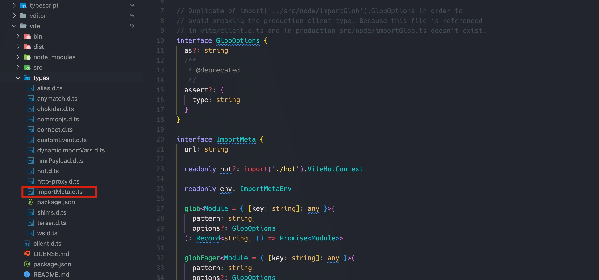

三斜线指令是一个包含单一XML标签的单行注释。注释的内容用作编译指令。

三斜线指令 `只有在` 文件的顶部位置才有效🚨。三斜线指令只有在单行或多行注释之前，包括其它三斜线指令。如果它放在语句或声明之后，则不会被当做是指令，而只是普通的注释。


## `/// <reference path="..." />`

`/// <reference path="..." />` 指令是三斜线指令中最常见的一种指令了。它充当文件之间 `依赖` 的一种声明。

三斜线引用指示编译器在编译的过程中包含其它的文件。

同时，当使用 [outFile](../tsconfig/compiler/emit#outfile) 编译选项时，它也作为方法对输出进行排序。在预处理之后，文件以与输入文件相同的顺序被生成到输出文件位置。


::: tip 🚀

一般表示对自己写的模块的引用，而 `/// <reference types="" />` 一般是外部声明文件模块的依赖。 它和 `/// <reference types="" />` 区别也在于此

:::


## 预处理输入文件

编译器会对输入文件执行一遍预处理，用于解析所有三斜线引用指令。在这个过程中，额外的文件会被加入到编译中。

这个处理会从一组 `root files`(根文件) 开始，根文件是指CLI后面跟着的文件或者 `tsconfig.json` 中 `files` 字段定义的文件，根文件会按照它们定义的顺序被处理。在文件添加到根文件列表之前，文件中所有的三斜线引用都会被处理，并且包含它们的目标文件。三斜线引用以深度优先的方式，以它们在文件中被看见的位置被解析。

::: tip

如果使用的是相对路径，三斜线引用路径按照包含它的文件的相对位置被解析

:::


## 错误

引用不存在的文件会报错。三斜线引用自身也会报错😅。


## 使用 `--noResolve`

如果编译器使用了 [noResolve](../tsconfig/compiler/modules#noresolve-%E4%B8%8D%E8%A7%A3%E6%9E%90) 标志，三斜线引用则会被忽略📚；它们既不会导致添加新文件，也不会改变文件提供的顺序。

## `/// <reference types="..." />`

和 `/// <reference path="..." />` 指令相似，它也充当依赖的一种声明，`/// <reference path="..." />` 指令是申明对某个包（`package`）的一种依赖。

::: tip

解析这些包名的过程和解析 `import` 语句模块名的过程类似。可以把 `triple-slash-reference-types` 指令当做是声明包的 `import` 语句💡。

:::

🌰在声明文件中包含 `/// <reference type="node" />` ，表明该文件使用 `@types/node/index.d.ts` 中声明的定义；因此，这个包需要与声明文件一起包含在编译中。

只有在你手动创建一个 `.d.ts` 文件时才会使用这些指令😎。

对于编译中生成的编译文件，编译器将自动给你添加 `/// <reference type="..." />`。只有在结果文件中使用到了任何引用包中的类型时，才会将 `/// <reference type="..." />` 包含到生成的声明文件中。

要在`.ts`文件中声明对`@types`包的依赖项，请在命令行或者tsconfig.json中使用 [types](../tsconfig/compiler/modules#types-%F0%9F%91%8D) 选项。

- [using @types, typeRoots and types in tsconfig.json files](https://www.typescriptlang.org/docs/handbook/tsconfig-json.html#types-typeroots-and-types) 了解更多

::: tip

一般表示对外部模块的引用

:::

## `/// <reference lib="..." />`

这个指令允许文件显式的包含已经存在的 `内置lib` 文件。

内置`lib`文件以tsconfig.json中 [libs](../tsconfig/compiler/lang-and-env#lib-%F0%9F%91%8D%F0%9F%9A%80) 编译选项相同的方式被引入（比如，使用 `lib="es2015"` 而不是 `lib="lib.es2015.d.ts"` 等等）。

对于依赖内置类型的声明文件作者，比如DOM APIs，内置JS运行时构造器（比如 `Symbol | Iterator`）,三斜线引用lib指令被推荐使用。再此之前，我们必须将这些 `.d.ts` 文件拷贝一份到项目中。

🌰添加 `/// <reference lib="es2017.string" />` 到编译中的某个文件中，相当于使用 `--lib es2017.string` 进行编译。

```typescript
/// <reference lib="es2017.string" />

"foo".padStart(4)
```


## `/// <referecne no-default-lib="true" />`

这个指令标记文件为 `默认library`。你可以在 `lib.d.ts` 顶部看到这个注解和其不同的变种。

这个指令告诉编译器不要将默认库（比如 `lib.d.ts`）包含到编译中。它的影响类似于给命令行传递 [noLib](../tsconfig/compiler/lang-and-env#nolib-%F0%9F%91%8D) 参数。

同样需要注意的是，当使用了 [skipDefaultLibCheck](../tsconfig/compiler/completeness.html#skipdefaultlibcheck) 选项，编译器只会跳过对包含了 `/// <reference no-default-lib="true" />` 指令的文件的检测。


## `/// <amd-module />`

默认情况下，AMD模块生成都是匿名的。但这会对一些工具处理结果模块时造成一些麻烦，比如bundlers(比如 `r.js`)

`amd-module`指令允许将可选模块名传递给编译器:

::: code-group

``` typescript [amdModule.ts]
/// <amd-module name="NamedModule" />
export class C {}
```

:::

这将导致将名字 `NamedModule` 作为调用AMD `define` 的一部分赋值给模块：


::: code-group

``` js [amdModule.js]
define("NamedModule", ["require", "exports"], function (require, exports) {
  var C = (function () {
    function C() {}
    return C;
  })();
  exports.C = C;
});
```

:::


## `/// <amd-dependency />`

::: warning

🚨这个指令已经废弃了。请使用 `import "moduleName";` 代替

:::

`/// <amd-dependency path="x" />` 通知编译器一个非TS模块依赖需要被注入到生成的模块require调用中。

`amd-dependency` 指令也可以有一个可选的 `name` 属性；这允许你给amd-denpendency传递一个可选name:

```js
/// <amd-dependency path="legacy/moduleA" name="moduleA"/>
declare var moduleA: MyType;
moduleA.callStuff();
```

生成的JS代码：

```js
define(["require", "exports", "legacy/moduleA"], function (
  require,
  exports,
  moduleA
) {
  moduleA.callStuff();
});
```


## 小结（个人补充）

看完这些，可能还是比较懵逼，下面以具体的例子对上面主要的指令进行演示。

以 `Vite` 项目为例。可以在 `tsconfig.json` 文件的 `types` 中看到这样的声明：

::: code-group

``` json [tsconfig.json]
{
  "compilerOptions": {
    "types": ["vite/client"]
  }
}
```

:::

这个类型位于：`node-modules/vite/client.d.ts`


这个等价定义 `/// <reference type="vite/client" />`指令。

我们也可以发现其定义了另外2个指令：

```typescript
/// <reference lib="dom" />
/// <reference path="./types/importMeta.d.ts" />
```

先看 `/// <reference path="./types/importMeta.d.ts" />` 是对相对路径引用，因为 `client.d.ts` 声明文件中用到了 `imprtMeta.d.ts` 中定义的类型



再看 `/// <reference lib="dom" />` 表示对typescript内置lib的引用，这里是因为用到了DOM APIs。

进入到 `lib.dom.d.ts` 声明文件内部，可以看到如下内容:


而 `/// <reference no-default-lib="true" />` 则表示 `lib.dom.d.ts` 是一个默认libray，它会告诉编译器，不要将 `lib.dom.d.ts` 这个内置lib包含到编译中。


原文档：

- [Tripe-Slash Directives](https://www.typescriptlang.org/docs/handbook/triple-slash-directives.html)


createAt: 2023年02月19日14:30:01

